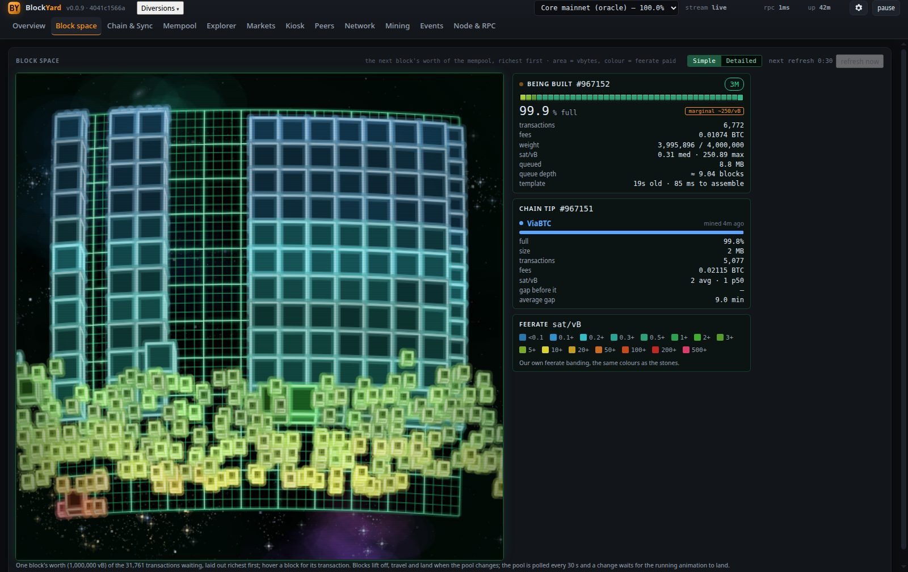

# BlockYard

A live, multi-user web monitor and block explorer for
[Bitcoin Core](https://github.com/bitcoin/bitcoin).

Point it at your node and open a browser: live charts, a 3D block-space viewer,
a block / transaction / address explorer, exchange prices with order-book depth, and a
kiosk view for a wall screen. No dependencies to install, no CDN, no telemetry, and
read-only toward your node by default.

**This is 100% machine-generated code, directed by a human operator.** Every line of the
server, the browser app, the 3D engine, the tests and these documents was written by an AI
under a human's direction, and all auditing has been performed by AI and is published in this
repository ([docs/SECURITY-AUDIT.md](docs/SECURITY-AUDIT.md), [docs/SECURITY-AUDIT-2026-09-14.md](docs/SECURITY-AUDIT-2026-09-14.md), [docs/DEFECTS.md](docs/DEFECTS.md),
[docs/MEASUREMENTS.md](docs/MEASUREMENTS.md)). It is **experimental pre-release software: expect
bugs.**


## Highlights

| | |
|---|---|
| **Block space, in 3D.** The next block's worth of the mempool as a board of glowing tiles: area is vbytes, colour is feerate. Refreshes are choreographed — blocks lift, travel in collision-free lanes and land under gravity — and the board comes alive at rest with **34 idle effects**, from ripples and light cycles to a lightning ball, ball lightning, a UFO's tractor beam, Missile Command, fireworks, code rain and a demoscene plasma. Two viewer modes: **Simple** (the richest few hundred transactions as cubes) and **Detailed** (every transaction in the block). |  |
| **A board you can tune.** Neon-tube blocks, a metallic sheen or a chrome finish that mirrors a horizon, a movable lamp, a touch of perspective, a spiral galaxy behind the board, and a switch for every one of the 34 effects — in a tabbed settings panel. Stored on the server (`config/blockyard.json`), so every screen sees the same board; they change how things are *drawn*, never what is measured. |  |
| **An explorer that looks the part.** Search a height, block hash, txid or address. Transaction pages with fee, fee rate and dollar value, feature badges, a flow diagram from inputs to outputs, and links to where every coin came from and went. **Address pages with full history and balance** — Bitcoin Core has no address index, so BlockYard builds its own from the node's block files (**a few hours** on first start, 124 GB) and keeps it current as blocks arrive. |  |
| **Markets.** Five exchanges' public prices: a 3D candle chart with a neon price line, a precise flat candlestick chart, an exchange table, and a bitcoinity-style order-book depth chart with change bars. Fetched by the server only while someone is looking. |  |
| **Kiosk.** The 3D markets board, a price panel and the block-space board side by side, full screen with one click. |  |
| **Tetrust, Blockout and Blockanoid.** Three playable games built on the same 3D engine — trust, but verify. Tetrust is Tetris: the well is the block-space board and the music is synthesised in the browser. Blockout is Breakout, where the wall is made of block-space stones and the bat follows your mouse. Blockanoid is Arkanoid: a different wall every level, silver bricks that take more than one hit, gold that takes none, and capsules that fall out of what you break — laser, wide, catch, slow, three balls, a life. All three pause when you look away and keep high scores per browser. |  |

Also on board: a sync viewer with an honest ETA, Block flow (projected blocks, the block
being built, recent blocks), mempool and fee charts, a peer table, bandwidth, the node's
event stream, a provenance table for every figure, a read-only RPC console behind a
default-deny allowlist, and a tabbed **Display settings** panel (the gear) that tunes every
board without a reload.

## Quick start

You need **Node.js 22 or newer** and a running **Bitcoin Core 25.0 or later** with `server=1`
and `txindex=1`, **on the same machine** — BlockYard reads the node's block files to build the
explorer's address index, and a node on another machine is not supported. Without `txindex` the
explorer cannot look a confirmed transaction up by id; everything else works without it (see
[Requirements](docs/INSTALL.md#1-requirements)). Plan for disk: the index is about **125 GB**, on
top of the node's own ~875 GB of block files.

```bash
git clone https://github.com/BobClawblaw/blockyard.git
cd blockyard
npm test            # optional: 866 unit tests, all built in
npm run setup       # reads the node's bitcoin.conf, checks the node, writes config/local.json
npm start           # builds the address index in the background (a few hours); open http://127.0.0.1:21000
```

`npm run setup` asks for the node's data directory, reads its `bitcoin.conf` for the rest,
proves the credentials, the chain, `txindex`, the block files and how fast the node answers,
writes `config/local.json`, and offers to start BlockYard there and then. The address index is
built **by BlockYard itself, in the background**, the first time it starts, and **it takes a few
hours** — about two on the default four workers on NVMe, longer on spinning disks (30 minutes on
16 workers) — with progress on the Overview and a notification when it is done; every other page
works meanwhile, and address pages fill in once it finishes. Step by step for macOS and Linux: **[docs/GETTING-STARTED.md](docs/GETTING-STARTED.md)**.
To try it first without a node: `npm run dev` runs against a built-in fake one on port 18088.
To check a setup again later: `npm run check`.

**Why the same machine?** Running BlockYard elsewhere and reading a node over RPC alone was
tried (2026-09-13) and abandoned: the charts filled in, but the explorer could not be made to
work in real time over RPC — Core has no address index, and the one RPC that can answer a
balance holds the node's RPC thread for tens of seconds per query. The address data has to be
rebuilt from the block files and stored locally, the way mempool.space's `electrs` does it, so
BlockYard lives next to the node. See
[It runs on the node's machine](docs/INSTALL.md#it-runs-on-the-nodes-machine).

The full walkthrough — service install, network exposure, accounts, TLS, a reverse proxy —
is in **[docs/INSTALL.md](docs/INSTALL.md)**.

## Documentation

| document | what it covers |
|---|---|
| [Getting started](docs/GETTING-STARTED.md) | macOS or Linux, from a command prompt: Core settings, Node 22, `npm run setup`, the background index build, running it |
| [Install](docs/INSTALL.md) | requirements, first run, systemd service, exposure, accounts, TLS, reverse proxy, updating |
| [Configuration](docs/CONFIGURATION.md) | every config key and environment variable, with examples |
| [User guide](docs/USER-GUIDE.md) | a tour of every tab and panel, and how to read them |
| [API](docs/API.md) | the JSON HTTP API and the Server-Sent Events stream |
| [Architecture](docs/ARCHITECTURE.md) | server, RPC lane, collectors, browser app and the 3D engine |
| [Security & privacy](docs/SECURITY.md) | the access model, hardening, and every outbound connection |
| [Troubleshooting](docs/TROUBLESHOOTING.md) | the problems people actually hit, and the fixes |
| [Contributing](CONTRIBUTING.md) | development setup, tests, and the project's rules |
| [Changelog](CHANGELOG.md) | release history |

Deeper reference material: [docs/RULES.md](docs/RULES.md) (the rules, each with the defect
that produced it), [docs/MEASUREMENTS.md](docs/MEASUREMENTS.md) (the node measurements the
design rests on) and [docs/DEFECTS.md](docs/DEFECTS.md) (known limits).

## Design principles

- **Read-only by default.** The monitor never writes to your node unless you enable
  individual actions, with accounts on and a typed confirmation per call.
- **A good guest.** Every request goes through one serialized, prioritised, batched lane,
  so the monitor never opens a burst of parallel calls against your node's RPC threads.
  It would rather skip a poll than slow your node down.
- **Honest data.** A missing figure is shown as missing, never as zero; stale data looks
  stale; inferred numbers are labelled as inferences; every figure's source is listed on
  the Node & RPC page.
- **Zero dependencies.** Node built-ins on the server; vanilla ES modules and hand-written
  canvas rendering in the browser. No build step, no CDN, nothing fetched from third
  parties by your browser.

## Security at a glance

- **Open, read-only access by default** — like a block explorer, anyone who can reach the
  port can look. Accounts, roles, sessions, CSRF protection and a per-user audit trail turn
  on with `BLOCKYARD_AUTH=1`.
- **Where it listens is your decision** — bind to `127.0.0.1`, a LAN address, a VPN
  address, or several. Built-in HTTPS with `BLOCKYARD_TLS_CERT` / `BLOCKYARD_TLS_KEY`.
- **Outbound connections are limited and on demand**: exchange APIs only while someone has
  the Markets, Kiosk or Overview tab open — Overview's price line is on by default, so the landing
  page reaches out unless you switch it off — plus a cached spot price for the explorer's dollar
  figures. `BLOCKYARD_MARKETS=0` turns all of it off.

Details in [docs/SECURITY.md](docs/SECURITY.md). To report a vulnerability, see
[SECURITY.md](SECURITY.md).

## Development

```bash
npm run dev          # fake node doing a simulated sync, port 18088
npm run setup        # interactive install: read bitcoin.conf, check the node, write config/local.json
npm run check        # the same checks (every call timed) against every configured node; exits 1 on a FAIL
npm test             # 866 unit tests (node:test, no dependencies)
npm run smoke        # boots the real server and checks the HTTP contract
npm run counts:fix   # keep the documented test count in step with the suite
```

See [CONTRIBUTING.md](CONTRIBUTING.md) for the project's rules (CSP, canvas, privacy,
RPC etiquette) and [docs/ARCHITECTURE.md](docs/ARCHITECTURE.md) for how it fits together.

## Status

Version **0.0.9** — the initial release, and pre-release software: the word is meant literally.
Published 2026-09-14: on [npm](https://www.npmjs.com/package/blockyard) as `blockyard`, as a
[GitHub release](https://github.com/BobClawblaw/blockyard/releases/tag/v0.0.9), and announced on
[bitcointalk](https://bitcointalk.org/index.php?topic=5594141.msg67144312) — questions, bug
reports and reviews are welcome there and in [issues](https://github.com/BobClawblaw/blockyard/issues).
The test suite is
comprehensive (866 tests, plus a live smoke run), the monitoring side is solid, and the
explorer's biggest gap is closed: **address history and balances**, which Bitcoin Core cannot
answer at any setting, now come from an **address index BlockYard builds itself** from the
node's block and undo files and keeps current as blocks arrive. It is checked against the node
(every balance equal to `scantxoutset`, to the satoshi) and costs a few hours on the default four
workers (~30 minutes on 16) and 124 GB of disk, built in the background the first time BlockYard starts and paced so the node's
RPC stays responsive; without one, the address page says *not indexed* rather than showing a
zero. An address's unspent outputs are listed too (for a history of up to 100 transactions).
What it does not yet have: an address's mempool transactions.

Everything here was written by an AI directed by a human, and audited by AI:
[docs/SECURITY-AUDIT.md](docs/SECURITY-AUDIT.md) and
[docs/SECURITY-AUDIT-2026-09-14.md](docs/SECURITY-AUDIT-2026-09-14.md) are the audits, findings
and remediation included. The test suite runs in CI on Ubuntu, macOS and Windows (Node 22 and 24);
a real install has been done on macOS (Core 29.1) and Linux, and Windows has only the test suite.
[docs/DEFECTS.md](docs/DEFECTS.md) lists five open items, honestly stated, with the
measurements behind each. Read it before deploying: several are node-capability limits
rather than bugs, and knowing which is which matters.

## Acknowledgements

The block-space view and the explorer are inspired by the look of
[mempool.space](https://mempool.space); the markets tab by
[bitcoinity.org](https://data.bitcoinity.org). Market data comes from the public APIs of
Coinbase, Kraken, Bitstamp, Bitfinex and OKX. The mining-pool labels shipped in
`config/pool-map.json` are mempool.space's curated
[mining-pools](https://github.com/mempool/mining-pools) list (MIT, 151 pools).

## License

Apache License 2.0 — see [LICENSE](LICENSE) and [NOTICE](NOTICE). The block-space packer and feerate palette are an original implementation (public/js/blockpack.js, public/js/feepalette.js), inspired by the look of mempool.space but containing none of its code.

---

<sub>If BlockYard is useful to you: `bc1q249cv27lc2q7y0x53vkczgfvvgsjzhwxwv42gc`</sub>
