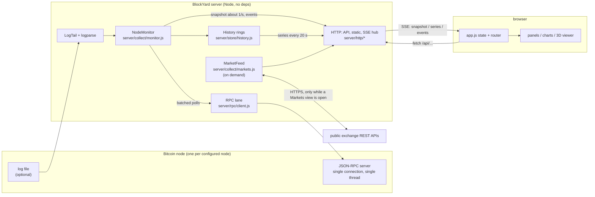
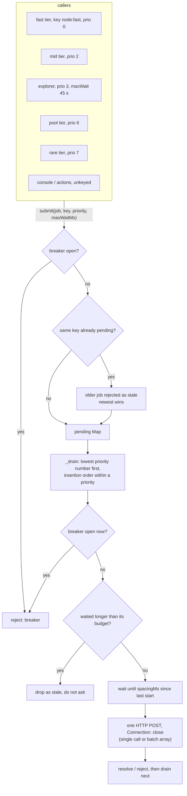
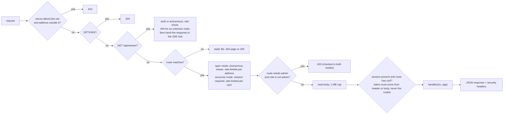
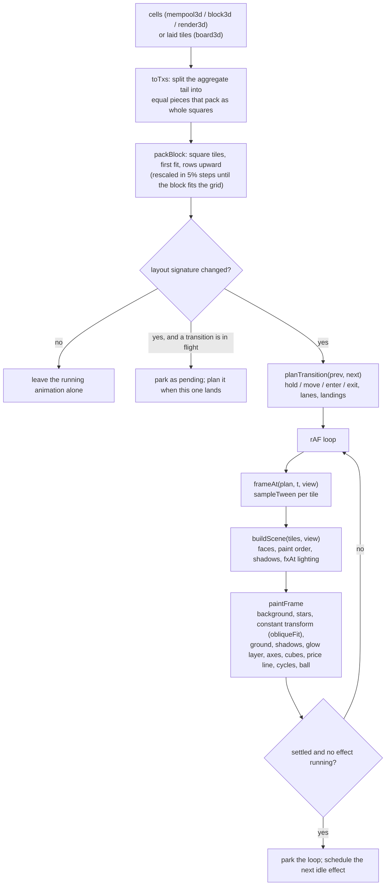
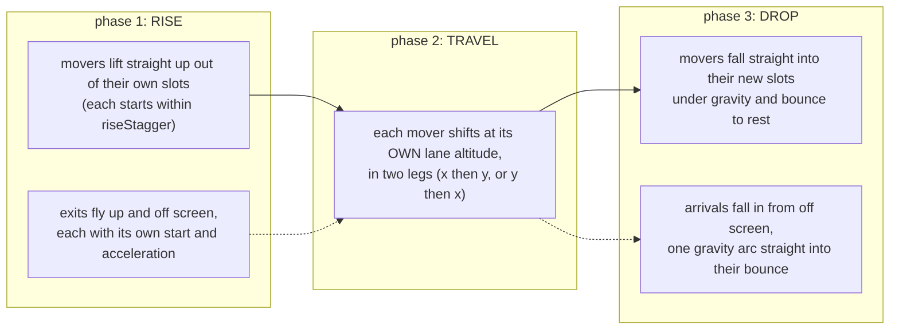
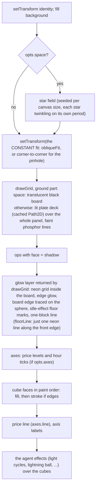

# Architecture

This guide is for contributors. It explains how BlockYard is put together, where
state lives, how data moves from the node to the screen, and which rules the code
depends on. It covers the reasoning as well as the structure, because most of the
unusual choices here are responses to measured behaviour of the node being
monitored.

Companion documents:

- `docs/RULES.md`: the engineering rules, each with the defect that caused it.
- `docs/MEASUREMENTS.md`: timings and payload sizes measured against real nodes.
  Check it before you change a poll interval, timeout or payload.
- `docs/DEFECTS.md`: known gaps, including the ones that are deliberately not fixed.

---

## 1. The big picture

BlockYard is a single Node.js process (Node 22 or later) with **no dependencies**.
It sits between one or more Bitcoin Core nodes and any number of
browsers:

- **Upstream**, it reads each node's JSON-RPC interface. If configured, it also
  follows the node's log file (experimental-node builds only; Bitcoin Core's
  `debug.log` is not parsed, and the log source is off by default). Where an
  address index has been built from a node's block files, it reads that too
  (section 2.8).
- **Downstream**, it serves a static single-page app (vanilla ES modules, all
  drawing done by hand on `<canvas>`), a JSON API, and a Server-Sent Events stream.



### Where state lives

| State | Location | Lifetime |
|---|---|---|
| Latest node state (chain info, mempool info, peers, fees, tips, ...) | `NodeMonitor.state`, one per node | memory; rebuilt by polling after a restart |
| Time series (node, mempool, net, fees, peers, blocks, txflow, rpc, self) | `History` rings, shared by every node, each row tagged with its node id | memory, **snapshotted to disk** |
| Event feed | `History.events`, newest first, capped | memory, stored in the same snapshot |
| Block stats map, mining attribution rows | `NodeMonitor.state.blocks`, `NodeMonitor.mining` | memory, bounded (`store.blockMapCap`, a 60-height attribution queue) |
| Market tickers, candles, depth snapshots | `MarketFeed` | memory; about an hour of depth history |
| Users, sessions | `data/users.json`, `data/sessions.json` | disk (atomic writes; session tokens are stored hashed) |
| Audit trail | `data/audit.jsonl` plus rotated `audit.N.jsonl` | disk, rotated by size |
| Display settings (effects, finish, the games' options) | `config/blockyard.json`, via `GET`/`POST /api/settings` | disk; the browser keeps a `localStorage` copy so boards still draw when the server is unreachable |
| Address index (rows per address and transaction) | the directory named by a node's `addressIndex` (section 2.8) | disk, built once (by the server in the background on its first start, or by `scripts/index-build.js`), then followed block by block |
| Browser cache | `state.byNode` in `app.js` | the tab's lifetime |

### What is persisted

Everything lives under `store.dir`. The default is `data/` in the repo;
`BLOCKYARD_DATA` overrides it.

- **`history.json`** holds every ring plus the event log. `History.save()` writes
  it with tmp, `fsync`, then rename, so a crash leaves either the old file or the
  new one, never half of one. Autosave runs every `store.snapshotEveryMs` (default
  120 s) while the store has unsaved rows, and once more at shutdown. On load, rows
  older than `store.retentionHours` (default 72) are pruned. Each ring holds at most
  `store.ringCapacity` rows (default 20,000). Downsampling happens when data is
  read (`Ring.series(field, { since, bucketMs, agg })`), so charts receive a few
  hundred points instead of the raw ring.
- **The ledger** (`server/store/ledger.js`) is a durable store for coinbase
  attribution rows, keyed by height. It has two engines behind one interface:
  `node:sqlite` (WAL, `synchronous=FULL`) when the runtime has it, and an
  append-only `fsync`'d JSONL file otherwise. Aggregation (`aggregate()`) is
  written in JavaScript over the same row shape, so both engines give the same
  answers. The module and its crash-safety behaviour are covered by
  `test/ledger.test.js`. The monitor's live attribution view is currently built
  from its bounded in-memory maps.
- **Pool labels** are read from `pool-map.json` and `pool-aliases.json` (edited
  by hand). A pool map ships in `config/pool-map.json` (from mempool.space's
  mining-pools data set, MIT, 151 pools); `data/pool-map.json`, written by
  `scripts/pool-map.js`, overrides it, and `BLOCKYARD_POOL_MAP` overrides both.
  The aliases file is optional. A tag no map knows is shown exactly as the miner
  wrote it.

### What is streamed

One SSE connection per tab (`GET /api/stream?node=<id>`) carries three event types:

| event | cadence | content |
|---|---|---|
| `snapshot` | at most one per second per node, coalesced | the read model from `NodeMonitor.snapshot()`: sync, tip, mempool aggregates, peers summary, net, attribution, the latest 40 blocks, log health, `health.quality` |
| `series` | every 20 s, only while clients are connected | chart series from `NodeMonitor.seriesView()` |
| `events` | batched as they happen | feed rows (routine log chatter is stored but not pushed) |

Large or slowly changing datasets are **not** in the snapshot. Each one has its
own endpoint and is fetched on its own schedule:

- the mempool scatter and cell list: `/api/mempool`
- the dense next-block view: `/api/mempool/dense`
- peer rows: `/api/peers`
- the block template: `/api/nextblock`
- block history beyond 40: `/api/blocks?limit=`

The test for whether a field belongs in the snapshot: does it change every second?
If it doesn't, it doesn't go in the snapshot (RULES 6).

---

## 2. The server

```
server/
  main.js            boot, wiring, shutdown, logger
  config.js          defaults + config/local.json + BLOCKYARD_* env overrides, validation
  netinfo.js         bind planning, CIDR parsing and membership
  rpc/client.js      the serialized RPC lane and the JSON-RPC client
  rpc/allowlist.js   which RPC methods the web UI may call; gated node actions
  collect/monitor.js NodeMonitor: poll tiers, log absorption, read model
  collect/sync.js    the sync bar's data contract (pure)
  collect/logtail.js log follower (rotation, truncation, partial lines)
  collect/logparse.js log line parsers (pure; target an EXPERIMENTAL node's grammar, not Core's)
  collect/mining.js  coinbase decoding and pool ledger folding (pure)
  collect/gbt.js       the block being built, assembled from the mempool (pure)
  collect/nextblock.js template summary and package analysis (pure)
  collect/markets.js exchange feed (tickers, candles, order books, spot price)
  store/ring.js      ring buffer, CounterRate, read-time downsampling
  store/history.js   named series, per-node views, atomic snapshots
  store/ledger.js    durable attribution store (sqlite or JSONL)
  store/audit.js     size-rotated audit trail
  auth/users.js      scrypt-hashed user store
  auth/sessions.js   sessions, CSRF, rate limiting, login guard
  http/server.js     request pipeline: gate, auth, CSRF, routing
  http/api.js        the route table
  http/sse.js        the SSE hub
  http/static.js     static files, CSP, nonce + build-id rewriting
  http/explorer.js   block / transaction pages over RPC; address pages from the local index
  chain/blockfile.js Core's blk/rev files read directly: XOR key, record framing, undo decoding (pure, read-only)
  chain/tx.js        raw transaction / block decoder in Core's verbose field names (pure)
  chain/index/rows.js   the 21-byte index row, built lean from block and undo bytes (pure)
  chain/index/build.js  the full build: heights, scan on a worker pool, check, sort, manifest
  chain/index/worker.js the build worker: scan one file pair, or sort one bucket
  chain/index/heights.js block hash -> height table in a SharedArrayBuffer, shared by the workers
  chain/index/store.js  IndexStore: base segments + layers + live tail, binary-searched lookups
  chain/index/live.js   LiveIndex: follows the chain over RPC, logs, rolls back, folds, merges
```

### 2.1 Boot (`server/main.js`)

`boot({ configFile, log })` builds a single `app` object and returns it. Tests call
it directly; running the file as a script calls it and prints the banner.

1. `loadConfig()` merges defaults, the config file, and `BLOCKYARD_*` environment
   variables, then validates the result. The config file is `config/local.json`
   unless `BLOCKYARD_CONFIG` names another file or `none`. Invalid or unsafe
   combinations are fatal. One example: enabling node write actions while accounts
   are off, unless that is also explicitly allowed.
2. TLS is decided before any listener exists. If a certificate and key are
   configured, every listener is HTTPS and the session cookie becomes `Secure`.
3. The history snapshot is loaded and autosave starts.
4. Users and sessions are loaded. If accounts are enabled and no user exists, a
   first admin is created and its password is printed once.
5. In open mode, a warning is logged that names the bound addresses and what an
   anonymous viewer can read.
6. `npm run dev` (`BLOCKYARD_FAKE_NODE=1`) starts an in-process fake node and
   replaces the node list with it, so a dev run never polls a real node.
7. One `NodeMonitor` is created per configured node. A node whose datadir is
   missing is skipped with a logged reason rather than kept as a permanently
   offline panel. `wireMonitor()` connects each monitor's events to the SSE hub
   and coalesces pushes to one snapshot per second.
8. `MarketFeed` is created if `markets.enabled` is set. It stays idle until the Markets
   API is requested with the **Enable market polling** setting on (off by default; read from
   the shared settings file per request, `marketsPollingOn` in `http/api.js`).
9. One HTTP(S) server is created per bound address, all sharing the same `app`.
   An address missing at boot is skipped with a warning. Boot is fatal only when
   none of the configured addresses exist.
10. Housekeeping timers start: self-telemetry, session sweeps, the 20 s series push.
11. For every distinct `addressIndex` directory in the node list, one `LiveIndex`
    follower is started (fed by a node with a local `datadir` where there is one)
    and registered with the explorer; it polls the node's tip every 30 s. A
    follower that cannot open its index logs why, and the address page says the
    same; nothing else waits on it (section 2.8). A directory with no finished
    index (no `manifest.json`) is **built here, in the background**, unless the
    node says `addressIndexBuild: "manual"` or has no `datadir` to read: worker
    threads inside this process, the build's own `RpcClient` on a second lane
    (its `getblockhash` batches once starved behind the monitor's multi-second
    reads), paced by the monitor's lane telemetry, progress as the
    `address-index-building` quality flag, `index` events at start, finish and
    failure, and the follower started on completion (section 2.8).
    `app.shutdown()` stops timers, closes streams, stops monitors, saves history
    and sessions, and closes the listeners. A build in flight is not resumed:
    the next start begins it again.

`boot({ log })` and `loadConfig({ ifaces, now })` are **seams**: tests inject a
logger, a fake interface list, or a fake clock instead of intercepting
`process.stdout` or the environment (RULES 22, 24).

### 2.2 `NodeMonitor` and the poll tiers

`NodeMonitor` (`server/collect/monitor.js`) owns one node. It polls the node's RPC
on a set of **tiers**, absorbs parsed log events, and turns both into `state`, ring
rows, feed events and `health.quality` flags. It also produces the read model,
`snapshot()`.

Each tier makes **one batched RPC request**: many methods in one JSON array, sent
on one connection. Each tier has its own coalescing key and priority in the lane.
Lower priority numbers run first.

| Tier | Default interval | Methods | Lane priority | Feeds |
|---|---|---|---|---|
| `fast` | 4 s | `getblockchaininfo`, `getmempoolinfo`, `getconnectioncount`, `getnettotals`, `uptime` | 0 | sync bar, tip, mempool counters, bandwidth rate, new-tip detection, reorg detection |
| `mid` | 15 s | `getnetworkinfo`, `getmininginfo`, `getchaintips`, `estimatesmartfee` for 1/2/6/24/144 blocks, plus `getpeerinfo` in RPC-only mode | 2 | network info, fees, side tips |
| `pool` | 20 s | `getrawmempool true` (heavy timeout) | 6 | mempool distribution and cells, the dense next-block set |
| `slow` | 60 s | `getindexinfo`, `getchaintxstats 120`, and `gettxoutsetinfo muhash` **only for a node whose `getindexinfo` reports a synced `coinstatsindex`** (the first run asks `getindexinfo` alone, so the answer is known before the question is put; without the index that call walks the whole UTXO set — 41 s measured, every minute, on the node's one RPC thread — so the figures are flagged `utxo-unindexed` instead) | 5 | UTXO set, indexes, tx rate |
| `rare` | 15 min | `getpeerinfo`, `getdeploymentinfo`, `getrpcinfo`, `getaddrmaninfo`, `listbanned` | 7 | peer table, deployments, address book, ban table |

Some reads are not on a timer:

- **New tip:** `getblockstats` runs for the new heights (at most the newest 24 in
  a burst). Mining attribution is queued for those heights: `getblock <hash> 1`
  plus `getrawtransaction <coinbase> 2`, one block per tick, newest first, and
  never during initial block download.
- **Block template:** assembled here, from the verbose mempool the pool tier
  already reads — **no RPC call of its own**. Core publishes `depends`, the
  ancestor sizes and fees, and `fees.chunk`/`chunkweight` (its own cluster-mempool
  linearization) in `getrawmempool(true)`, which is everything the selection needs.
  `/api/nextblock` serves it; it is as fresh as the pool tier's last read (20 s)
  and takes ~50-70 ms of *our* CPU. Measured against the node's own
  `getblocktemplate` on the same pool: 0.03% apart on fees (`collect/gbt.js`).
- **Explorer and console:** requests from the explorer and the read-only RPC
  console go through the same lane (see 2.4).

Tier scheduling:

- **Staggered start.** The first runs are offset by 0, 0.7, 1.2, 1.6 and 2.6 s,
  so boot does not send five requests at once to a single-threaded server.
- **Adaptive cadence.** `effectiveTierMs(name)` stretches a tier to the larger of
  2x the lane's average latency and 1.5x that tier's last run. The result is
  capped, and the cap is never below the configured base (RULES 12). Once the
  node speeds up, cadence returns to the configured value on its own.
- **Heavy-tier skip.** While average RPC latency is above 4x `rpc.slowLatencyMs`,
  the `pool`, `slow` and `rare` tiers are skipped, except every fifth attempt.
  This keeps the cheap `fast` tier fresh. The skip is announced as a quality flag.
- **No overlap.** A tier that is still running is not started again.

What the UI receives about once a second is `snapshot()`. It is assembled on
demand from `state`, the rate counters, the log state and `rpc.telemetry()`.
Beyond the raw figures, it carries the reasoning the UI needs to be honest:

- `sync` (from `collect/sync.js`) keeps two figures apart. `pct` is
  blocks/headers, which fills the bar. `verificationProgress` is the node's own
  estimate, drawn as a separate tick. The object also carries rate windows, an ETA
  with its basis, caveats, and `strip`, the pre-assembled facts for the one-line
  header.
- `hashrateEstEh` is withheld during IBD, with `hashrateNote` giving the reason.
- `net.downloadMeasured` and `net.uploadMeasured` gate on counters that actually
  move, so a counter stuck at zero is drawn as absent rather than as an idle link.
- `health.cadence` reports the configured and effective interval of every tier.
  `health.quality` lists the named gaps: what the monitor cannot currently tell you,
  and why.
- `log.health` reports parser coverage and how long the log has been quiet.

### 2.3 Collectors

- **`collect/sync.js`**: the sync state machine (`unknown`, `ibd`, `catching_up`,
  `synced`, `stalled`, `reorg`) and the ETA rules. It refuses to estimate an ETA
  without a measured rate over at least 60 s of samples. `computeSync` takes
  `peerBestHeight` (the monitor passes the highest `synced_headers`, or
  `startingheight`, over `getpeerinfo`): a node is `stalled` only when its peers
  report a tip above the one it holds; a long gap with the peers agreeing is
  `synced` with a caveat; with no peer heights at all it is `stalled` after
  7200 s, because a 40-minute gap happens about once in fifty on the network. It
  is pure and unit-tested.
- **`collect/logtail.js`**: follows a file by polling, with `fs.watch` used only
  as a wake-up. On rotation it drains the old inode to EOF before switching to the
  new file. If the file shrinks, it restarts at 0. A partial last line is carried
  over to the next read. At start it backfills the last `log.tailBytes`.
- **`collect/logparse.js`**: pure parsers for the node's log lines. **These target an
  experimental node implementation's log grammar and do not support Bitcoin Core's
  `debug.log`**: measured 2026-09-13, Core lines return unstructured `raw` events with no
  fields and a fallback timestamp. The log source is off by default and should stay off
  against Core. Labelled lines
  are scanned **field by field**, so a new field costs only that field, which is
  kept verbatim in `extraFields`, rather than the whole line (RULES 16). `SHAPES`
  and `RULE_TO_SHAPE` drive per-shape liveness flags. Coverage is published as
  `log.health.ratio` and held to a threshold against a frozen real sample (RULES 15).
- **`collect/mining.js`**: coinbase scriptSig push decoding, tag extraction, and
  folding rows into per-pool counters. It never invents pool names.
- **`collect/gbt.js`**: assembles the block being built from `getrawmempool(true)`,
  in the shape a `getblocktemplate` reply has, so every consumer below reads it
  unchanged. Greedy over the node's own chunk feerate, each transaction taken with
  its unselected ancestors. Pure.
- **`collect/nextblock.js`**: turns that template into the next-block card: header
  figures, a fixed-bucket feerate histogram, and ancestor packages built from
  `depends`. Pure, and still able to read a real `getblocktemplate` reply.
- **`collect/markets.js`**: `MarketFeed`, the only outbound connection that is not
  a node. It is covered in detail below.

#### The market feed

The browser's CSP only allows connections to its own origin
(`connect-src 'self'`), so exchange data is fetched by the server. The feed reads
the public, unauthenticated REST endpoints of five exchanges: Coinbase, Kraken,
Bitstamp, Bitfinex and OKX.

- **Starts on demand.** `GET /api/markets` and `/api/markets/depth` call
  `touch()`. The first touch starts three timers:
  - tickers every `markets.tickerMs` (15 s)
  - hourly candles every `markets.candleMs` (5 min, the latest 168)
  - order books every `markets.bookMs` (30 s)
- **Stops when idle.** Polling parks after `markets.idleAfterMs` (10 min) without
  a request. A monitor nobody is watching makes no exchange traffic.
- **Depth snapshots.** Each book poll turns every exchange's book into cumulative
  depth on a fixed grid: $50 levels, ±12% around the median mid price.
  `depthOf()` returns `null` past the end of a truncated book instead of
  extending it. About an hour of snapshots is kept, and `depthView(ago)` realigns
  an older snapshot onto the current grid for the "then" line and the change bars.
- **Spot price.** `spot()` supplies USD figures to the explorer. It uses the
  median of fresh tickers if the feed is running. Otherwise it makes two USD
  ticker reads, cached for a minute. The explorer waits at most 1.5 s for it
  (`withUsd` in `api.js`).
- **Honest ages.** Every figure keeps its age. A failing exchange is reported
  with its error, never zero-filled. Tickers older than three intervals are marked
  `stale`.

Polling is off by default — the **Enable market polling** Display setting turns it on, and a
request with it off parks the feed. `BLOCKYARD_MARKETS=0` (or `markets.enabled: false`)
removes the feed altogether.

### 2.4 The RPC lane (`server/rpc/client.js`)

**The central constraint:** the node's RPC server services **one connection at a
time on one thread**. A bare `getblockcount` has been measured at 40 s on a node
doing initial block download (MEASUREMENTS 1). A dashboard where every tab polls
on its own would be a denial of service against the node it exists to watch. So
every RPC request, from every poll tier, every user, the explorer and the console,
goes through **one `Lane` per node**.



Properties:

- **One in flight.** `busy` gates `_drain()`. The node could not use more than one
  connection anyway, and a second request would only queue inside the node, where
  the monitor cannot see or cancel it.
- **Minimum spacing.** `spacingMs = max(rpc.minIntervalMs, 1000 / rpc.maxRatePerSec)`.
  The defaults (250 ms, 4 per second) both come to 250 ms between request starts.
- **Batching.** `RpcClient.batch(calls)` sends a JSON array, which the node
  answers on one connection. Replies are matched back to calls by id. A method
  that fails inside a batch is reported for that method only; the rest of the
  batch still succeeds.
- **Coalescing by key.** Poll jobs carry a key such as `<node>:fast`. A new job
  with the same key replaces a pending one, and the old one is rejected with
  `kind: 'stale'`. User-initiated calls carry no key, so each one is answered.
- **Priority.** Without it, a 60+ second heavy batch once starved the cheap poll
  that feeds the sync bar. With it, `fast` always runs next.
- **Stale drop.** A job still queued after its budget (`rpc.staleDropMs`, 12 s by
  default; explorer jobs 45 s) is dropped rather than run. The answer would
  describe a moment that has already passed, but would be displayed as current.
- **Circuit breaker.** After `breakerThreshold` (3) consecutive failures (timeout,
  transport, auth or parse errors, but not RPC-level errors and not stale drops),
  the lane refuses new and queued work for `breakerCooldownMs` (30 s). The breaker
  is checked both at submit and at dequeue. `breakerState()` records which call
  opened it and what it blocked.
- **Timeouts.** `rpc.timeoutMs` is 90 s and `heavyTimeoutMs` is 300 s, sized from
  measurements rather than guesses (RULES 1). Failures and timeouts are also timed,
  so a node that stalls for 90 s shows up in the latency statistics that adaptive
  cadence reads.
- **No keep-alive.** Holding a socket open between requests would hold the node's
  only service slot.
- **Cookie auth.** Credentials are resolved lazily and re-read once on a 401,
  because the node regenerates its cookie every time it starts.

### 2.5 The RPC allowlist (`server/rpc/allowlist.js`)

The read-only console (`POST /api/rpc`) may only call methods that
`classifyMethod()` allows. The decision order:

1. **Explicit deny list**, checked first. It covers wallet key derivation (even
   methods that start with `get`), spends, wallet state, peer control, chain
   mutators, and heavy reads that would monopolise the node (`rescanblockchain`,
   `scantxoutset`, `verifychain`, ...).
2. **Deny prefixes** such as `send`, `set`, `import`, `sign` -- and, on a node that
   adds vendor-prefixed commands of its own, their vendor-prefixed forms too.
3. **Allow prefixes** that read as reads: `get`, `list`, `estimate`, `decode*`,
   ... A node's vendor-prefixed **read** verbs are admitted by name; the bare vendor
   prefix deliberately is not, so a future vendor-prefixed `setban` cannot slip in.
4. **Anything else is denied.** The reply says which file to edit.

Node **writes** do not go through this file. They are named `ACTIONS` behind
`POST /api/action`. An action must be enabled (`BLOCKYARD_ENABLE_ACTIONS=1`) and
listed in `actions.allow`. The caller must hold the action's role and send a
typed confirmation equal to the action's name. With accounts off, actions also
need `BLOCKYARD_ALLOW_WRITES_WITHOUT_AUTH=1`, which is checked again inside the
route. Every action is audited.

### 2.6 HTTP (`server/http/*`)

**Request pipeline** (`server.js`, one server per bound address):



- **`api.js`** is a declarative route table: `{ method, path, auth, csrf, body,
  handler }`. `auth` is `none`, `any` or `admin`. Handlers are thin: most call
  `pickNode(ctx, app)` (from `?node=`, falling back to the primary node) and
  return part of that monitor's read model. The main groups:
  - health, build, session: `/api/health`, `/api/build`, `/api/about`, `/api/me`,
    `/api/login`, `/api/logout`, `/api/logout-all`
  - the read model: `/api/state`, `/api/sync`, `/api/mempool`,
    `/api/mempool/dense`, `/api/peers`, `/api/net`, `/api/mining`,
    `/api/nextblock`, `/api/blocks`, `/api/series`, `/api/events`, `/api/nodes`,
    `/api/telemetry`, `/api/config`
  - drill-down: `/api/block`, `/api/tx`
  - explorer: `/api/x/search`, `/api/x/block`, `/api/x/tx`, `/api/x/address`
  - markets: `/api/markets`, `/api/markets/depth`
  - console and actions: `/api/rpc`, `/api/actions`, `/api/action`
  - configuration written by the app: `/api/config/node/test` and
    `/api/config/node` (the node-connection form; credentials go only to the
    endpoint already configured), `/api/settings` (display settings, stored in
    `config/blockyard.json`). State-changing routes in open mode refuse
    cross-site requests by `Origin` / `Sec-Fetch-Site`.
  - admin: `/api/users*`, `/api/password`, `/api/audit`
- **`sse.js`** (`StreamHub`): each client has at most one pending snapshot and one
  pending series frame, and the newest replaces the older one. Event rows are
  batched, capped at 800 per client, and trimmed if a client falls behind. Writes
  are flushed on `setImmediate`. A comment ping every 15 s keeps intermediaries from
  closing idle streams and detects dead sockets. A slow client gets fewer updates,
  never an unbounded queue.
- **`static.js`**: serves files from `public/`.
  - **Containment** is checked on the `realpath`, so both `../` traversal and
    symlinks planted inside `public/` are refused.
  - **HTML is rewritten per response** (`renderHtml`): a fresh script nonce
    replaces `%BLOCKYARD_NONCE%`, the build id replaces `%BLOCKYARD_BUILD%`, and asset URLs get
    `?v=<build>`.
  - **The build id** is computed from the sizes and mtimes of files under
    `public/`. The page compares the build it loaded with `/api/build` and tells
    the user when the tab is out of date.
  - Every response carries the same security headers. HSTS is added only on TLS
    listeners.
- **`explorer.js`**: block and transaction pages built from this node's own RPC;
  address pages from the local address index.
  - **Batched.** Each page is one or two batched lane requests at priority 3.
    Fetching 25 transactions one call at a time would take several seconds at
    250 ms spacing.
  - **Cached.** Confirmed transaction summaries are kept in an LRU of 3,000.
  - **Cheap reads only.** `getblock` verbosity 2 is never used (it is megabytes
    per block on this node).
  - **Addresses.** Core has no address index at any setting, so `xAddress` reads
    the index a node names in `addressIndex` (section 2.8): count, balance,
    received and sent, and the transactions newest first with the net change
    each made, 25 a page, and the unspent outputs (each output the index says
    paid the address, checked with `gettxout`, for histories of at most 100
    transactions; longer ones get `utxos: null` and a `utxoNote`). The reply
    carries `index.tip`, `index.behind`, `index.following`, `index.stale` and
    `index.postTip`. Without an index the reply says `indexed: false` with a
    **null** count, never a fabricated zero, and the two insight-style RPCs Core
    refuses are remembered as refused for ten minutes rather than re-sent on
    every view. While the server is building the index, the same shape carries
    `indexBuilding` (phase, done, total, rows, eta, paused) from the status
    object `main.js` registers with `registerIndexBuild`.
  - **Errors are sentences.** Handlers return `{ ok: false, error, hint }` rather
    than throwing.

### 2.7 Auth (`server/auth/*`)

- **Sign-in by default** (since 2026-09-15; it shipped open in 0.0.9), bound to
  `127.0.0.1`. With `auth.enabled: false` (`BLOCKYARD_AUTH=0`), every request is
  served as a frozen anonymous user with role `viewer`. That ceiling is hardcoded,
  not configurable. Admin routes return 403 in both modes, CSRF is not needed
  because there is no cookie to ride, and rate limits apply per client address.
- **Accounts** (the default; `BLOCKYARD_AUTH=1` restores them after an override):
  - scrypt password hashes (upgraded to current parameters on login)
  - session tokens that are stored hashed, with idle and absolute TTLs
  - double-submit CSRF (the token in a header or body is compared with the
    server-side session, never with the cookie; RULES 3)
  - a per-username lockout (`LoginGuard`) and a separate per-address limit on
    `/api/login`
  - roles `viewer` < `operator` < `admin`
- **Auditing.** Logins, RPC calls, denials and actions are appended to the audit
  trail. Credentials are removed from entries before they are written.

`node scripts/manage-users.js` administers users from the command line.

### 2.8 The address index (`server/chain/*`)

Bitcoin Core cannot answer "which transactions touched this address": the
insight-style `getaddresstxids` and `getaddressbalance` are refused at every
setting, and `scantxoutset` reads the whole UTXO set for a balance only
(measured: 26.5 s for 40 addresses, holding the node's one RPC thread). So
BlockYard builds the index itself, the way `electrs` does, from the node's own
files. The numbers are in `docs/MEASUREMENTS.md` §28-30 and the history in
`docs/DEFECTS.md`.

- **Reading the files** (`chain/blockfile.js`). `blocks/blkNNNNN.dat` holds the
  blocks as received; `revNNNNN.dat` holds the undo data written when each block
  was connected, which names every spent output's value and script. Both are
  XOR-obfuscated at rest since Core v28 (`blocks/xor.dat`). Undo records are
  paired with blocks in connection order and checksum-verified. The files are
  opened for reading and nothing else, and the reader copes with the newest file
  still being appended to. `chain/tx.js` decodes raw transactions and blocks into
  Core's verbose field names, checked field-for-field against `getblock <hash> 3`
  (`scripts/decode-check.js`).
- **The row** (`chain/index/rows.js`): 21 bytes per (script, transaction that
  touched it) -- 8 bytes of `sha256(scriptPubKey)`, a 3-byte height, a 2-byte
  position in the block, and the signed net satoshis the transaction moved for
  that script -- big-endian, so byte order is sort order. A script paid and spent
  in one transaction is one row. Spends come from the undo record, so no UTXO
  replay. The rows are built lean, straight from the bytes, and checked
  row-for-row against rows from the full decoder.
- **The build** (`chain/index/build.js`, `node scripts/index-build.js --out <dir>`):
  block hashes for every height in batches of `getblockhash` (`heights.js`, a
  `SharedArrayBuffer` table every worker reads); every blk/rev pair scanned on a
  worker pool (`worker.js`), rows partitioned by the key's first byte into 256
  bucket files; a check that every height is indexed exactly once, or the build
  stops rather than publish a hole; each bucket sorted into `seg-XX.rows` plus a
  sparse `seg-XX.idx` (one key per 4,096 rows); and a manifest written last, so an
  index without one is unfinished. Measured on the whole chain: 29 min 45 s on 16
  workers, 5.89 billion rows, 123.7 GB (§30). The build reads ~880 GB and writes
  ~120 GB, so `--out` should be a different device from the block files.
- **Lookups** (`chain/index/store.js`, `IndexStore`). The sparse keys of the 256
  base segments and of every layer are held in memory; a lookup binary-searches
  them and reads only the row blocks that can hold its key, then merges the base,
  the layers and the live tail in height order. Measured: 0.25 ms median first
  touch, 0.03 ms warm; a 2.3 M-transaction address summed in 83 ms. **No file is
  held open**: a lookup opens the one file it reads and closes it (three
  syscalls on a 0.25 ms lookup). The store used to keep one descriptor per
  segment and layer, 256 and more, which is the whole soft limit on a stock
  macOS (`ulimit -n` 256) before the server has opened a socket.
- **The build inside the server** (`main.js`, using `buildIndex`, `defaultWorkers`
  and `rpcPacer` from `build.js`). A configured directory with no
  `manifest.json` is built in the background on the server's first start, unless
  `addressIndexBuild: "manual"`. Workers: `addressIndexWorkers` if set, else half
  of `defaultWorkers()` (`cpus − 4`, one per ~2.5 GB, at most 16) capped at 4,
  because the node shares the disk. The build has its own `RpcClient` on a second
  lane — on the monitor's one-in-flight lane its `getblockhash` batches sat
  behind multi-second mempool and block reads and both starved. It is **paced by
  the node's own answers**: `rpcPacer` reads the monitor lane's telemetry before
  each file is handed to a worker, holds (re-checking every 10 s) while the node
  is failing, its breaker is open or its average latency is above
  `rpc.slowLatencyMs` (5 s), and eases to one file per 250 ms above 40% of it.
  Measured on the first Mac install: a build at full speed on the node's disk
  turned its RPC into 18 s answers and 90 s timeouts. Progress is the
  `address-index-building` quality flag (phase, done of total, rows, ETA from
  the phase's own rate, `paused while the node's RPC is slow`), refreshed at most
  every 5 s; `index` events mark start, finish and failure; on finish the follower
  starts and address pages go live with no restart; failure leaves
  `address-index-build-failed` naming the command to run by hand. There is no
  resume: a build stopped with the server starts over next time.
- **Following the chain** (`chain/index/live.js`, `LiveIndex`). The base is
  immutable and covers the chain to the block it was built at. The follower polls
  the node's tip, rolls the tail back to the fork if a block it holds is no longer
  on the node's chain, and fetches each new block with `getblock <hash> 3` over
  RPC (so it works for a node whose files are elsewhere), turning it into the same
  rows (`verboseBlockRows`, checked against the file builder). Every block and
  every rollback is appended to `<index>/live.log` -- CRC-framed, replayed on
  restart, truncated at the first torn record -- **before** it is served. Blocks
  100 deep are folded, 144 at a time, into immutable `layers/L<from>-<to>` and the
  log is rewritten without them; past 32 layers they are merged. A reorganisation
  deeper than the tail is not repaired: the index reports itself stale and the
  page says to rebuild.
- **Configuration.** `addressIndex: "<dir>"` on a node entry, with
  `addressIndexBuild: "manual"` to keep the server from building a missing one
  and `addressIndexWorkers` for the background build's thread count (the
  installer writes the number given; 1 on a spinning disk). One index serves
  every node on the same chain (the store refuses a manifest for another chain);
  the directory must be writable by the service, because the follower writes
  `live.log` and `layers/` inside it. The explorer opens a store once and reopens
  it when a rebuild replaces the manifest.
- **Scripts.** `scripts/blockfile-measure.js` (what a full read costs, `--verify`
  against the node), `scripts/index-bench.js` (SQLite against sorted flat files,
  §29), `scripts/index-build.js` (the build, by hand), `scripts/index-benchmark.js`
  (lookup latency and `--verify` balances against `scantxoutset`, §30),
  `scripts/setup.js` (the installer: reads the node's `bitcoin.conf`, proves the
  node with `scripts/check.js`, writes the config, builds the index or leaves it
  to the server) and `scripts/check.js` (the same checks against every configured
  node, every RPC call timed — measure a slow node alone before blaming what runs
  beside it).
- **Tests**: `test/chain-blockfile.test.js`, `test/chain-tx.test.js`,
  `test/chain-index.test.js`, `test/chain-index-live.test.js`.

---

## 3. The browser

`public/index.html` is the whole application shell: a header, a nav, and one
`<section class="page" data-page="...">` per page. All scripts are ES modules
loaded from the same origin. There is no build step and no framework.

| Module | Role |
|---|---|
| `app.js` | state, API client, SSE client, hash router, render dispatch, background refresh, watchdogs, the sync strip, the Overview page |
| `panels.js` | Chain, Mempool, Peers, Network, Events, Node & RPC, Admin pages |
| `mining.js` | Block flow, the Block space viewer (both modes), the Mining page and next-block panels |
| `charts.js` | the canvas chart kit: `lineChart`, `histogram`, `scatter`, `meter`, `stackedBars`, `sparkline`, and `paint()` |
| `explorer.js` | explorer pages (pure renderers, one fetch per route) |
| `markets.js`, `pricechart.js`, `depthchart.js` | Markets page: flat price chart with axes and crosshair, the same candles on the 3D board, the depth chart |
| `kiosk.js` | the 3D Markets board and the Block space board side by side, with a full-screen button |
| `goggles.js` | the 2D treemap maps (squarified) |
| `blockpack.js`, `feepalette.js`, `blockscene3d.js`, `details3d.js`, `agents.js` | the 3D engine (section 4) |
| `settings.js` | display settings: `DEFAULTS`, the `PANEL` rows of the settings dialog, `normalise()`, and the option builders (`spaceOptions`, `enabledEffects`, ...) the boards read; stored on the server (`/api/settings`) with a `localStorage` copy |
| `about.js` | the About page (version, system and node info) |
| `tetris.js` / `tetrust.js`, `breakout.js` / `blockout.js`, `arkanoid.js` / `blockanoid.js`, `tetsound.js` | the Diversions: pure game rules in the first file of each pair, the tab drawn on the 3D engine in the second, and Tetrust's sound |
| `x86.js`, `dospc.js`, `soundcard.js`, `dosworker.js`, `dosaudio.js`, `dosio.js`, `dosgame.js`, `doom.js`, `quake.js` | the DOS Diversions: an i386 interpreter, the PC around it (DOS/4GW for DOOM, the go32 stub and CWSDPMI for Quake), a Sound Blaster Pro 2 with an OPL3, the worker the machine runs in, the AudioWorklet it plays through, the pure keyboard/config/text-mode helpers, the shared tab, and each game's own few lines (section 3.4) |
| `fmt.js` | formatters: decimal units (as the node prints them), `–` for anything absent |
| `login.js` | the login page (a separate file because of the CSP) |

### 3.1 `app.js`

**State.** A single exported `state` object. The main fields:

- `snap`, `series`, `events`: what is currently displayed.
- `byNode`: a per-node cache of snapshot and series, so switching back to a node
  is instant.
- `node`: the node being watched.
- `page` and `xroute`: the current page and explorer subroute.
- `viewerMode`: the Block space viewer mode, remembered in `localStorage`.
- `mempoolDist`, `denseBlock`: the pool data the viewers draw.

**Data flow.**

```mermaid
sequenceDiagram
  participant B as app.js
  participant S as server
  B->>S: GET /api/me, /api/nodes, /api/config, /api/build
  B->>S: GET /api/state?node=... (backgroundRefresh)
  B->>S: GET /api/events?limit=200
  B->>S: EventSource /api/stream?node=...
  loop about once a second
    S-->>B: event: snapshot  (state.snap = s; render())
  end
  loop every 20 s
    S-->>B: event: series  (merged into the cache, never replaced)
    B->>S: GET /api/state (only while the tab is visible and not paused)
  end
  S-->>B: event: events  (feed rows, capped at 1,500)
  Note over B: page-scoped fetches on their own schedules:<br/>/api/mempool (30 s on the viewer pages),<br/>/api/nextblock (20 s on Mining and Block space, 60 s on Overview),<br/>/api/peers (15 s on Peers), /api/markets (while Markets is open)
```

**Rendering is event-driven.** `render()` runs when a frame arrives, on a page
change, on resize, and after a page-scoped fetch completes. It switches on
`state.page` and calls that page's renderer with `(snapshot, state, helpers)`.
`helpers` is how the page modules get `api`, `toast`, `setText`, `canvas`, the
chart kit and the fetch helpers without importing `app.js` (which would be a
circular import).

Continuous animation does **not** go through `render()`. Each 3D canvas runs its
own `requestAnimationFrame` loop, which stops as soon as the picture is still
(section 4.7).

**Router.** The route is the URL hash: `#overview`, `#space`, `#chain`, ...
`#explorer` has subroutes (`#explorer/block/<height|hash>[/<page>]`,
`#explorer/tx/<txid>`, `#explorer/address/<addr>[/<page>]`), which `setPage()`
splits into `state.page = 'explorer'` and `state.xroute`. Every explorer page is
therefore a shareable link.

**Liveness and honesty rules in the client.**

- **Data is never nulled.** `state.snap` and `state.series` are never set to
  `null`. Canvases are wiped in exactly one place, `switchNode()`, because the
  pixels on screen belong to a different node.
- **Charts draw through `paint(canvas, { when, draw, placeholder })`.** A missing
  sample marks a populated chart stale with a pill. It never erases it.
- **A watchdog runs every 15 s.** If nothing has arrived for 90 s, it tries to
  recover the stream. If the node was removed from the config, it switches to a
  node that exists. Otherwise it says in a banner that the figures are old. The
  stream badge changes to `stale` when the snapshot is old.
- **Build check.** Every 5 minutes the tab compares the build it loaded with the
  server's current build and says when it is running replaced code.
- **"Refresh now"** on the pool viewers is enabled only while that viewer's board
  is at rest (`viewerIdle(canvas)`).

### 3.2 Page modules

- **`mining.js`**
  - **`blockFlow()`**: the block being built on the left, the chain tip in the
    centre, recent blocks to the right. The arrival animation is keyed on the
    chain's tip height and plays only when the page actually saw the tip change,
    never on first paint. The rail's speed comes from the measured average block
    gap.
  - **`renderBlockSpace()`**: the `#space` page. The pool viewer at panel size,
    plus the next-block and tip panels.
  - **Viewer modes** (`VIEWER_MODES`). Simple (id `1`) shows the richest cells as
    cubes and the tail as equal aggregate pieces on a 44-unit board. Detailed
    (id `2`) shows every transaction in the next block's worth, from
    `/api/mempool/dense`, as low slabs on a 96-unit board (`DENSE_OPTS`:
    `resolution: 96, slab: 1.2, order: 'diagonal', gridStep: 8`). Both modes use
    full transaction ids, so switching modes moves tiles rather than emptying and
    refilling the board, and a click on a tile opens it in the explorer.
  - **One viewer everywhere.** `poolViewer()` is used on Overview, Block space,
    Mempool and Kiosk, so the viewer cannot drift apart between pages.
- **`explorer.js`**: pure `data -> HTML` renderers, plus `renderExplorer()`, which
  fetches once per route and repaints only when the output would change, so a
  half-typed search survives the once-a-second frames.
- **`markets.js`**
  - **The two boards.** It lays out candles as `board3d` tiles with a custom
    camera (`CAMERA_3D`, section 4.8). `pricechart.js` draws the flat, readable
    chart with axes and a crosshair.
  - **The depth chart** (`depthchart.js`) draws cumulative bids and asks per
    exchange, the combined line, the combined line N minutes ago, and change bars
    on a symmetric log axis.
- **`kiosk.js`** reuses `renderMarketsBoard` and `poolViewer` unchanged.

### 3.3 CSP constraints

The CSP (`server/http/static.js`) is same-origin only:

```
default-src 'self'; script-src 'self' 'nonce-<per response>'; style-src 'self';
img-src 'self' data:; font-src 'self'; connect-src 'self'; frame-ancestors 'none';
base-uri 'self'; form-action 'self'; object-src 'none'
```

What this means for front-end code:

- **No `style="..."` attributes**, in HTML files or in markup injected through
  `innerHTML`. `style-src` has no `'unsafe-inline'` and there is no
  `style-src-attr`. For data-driven sizes, write `data-w`, `data-left` or `data-h`
  and call `applyDataSizes(root)`, which writes the number through the CSSOM
  (`el.style.width = ...`). CSP allows that, and a value that never becomes an
  attribute cannot be an injection point. Static styling belongs in classes in
  `public/css/app.css`. CSS custom properties set with `style.setProperty()` are
  fine.
- **No inline scripts** unless they carry the per-response nonce. In practice
  every script is an external module.
- **No CDN, no third-party fetch.** External data (exchange prices) is fetched by
  the server.
- **Escape all text** that comes from the node, a log line or an exchange with
  `fmt.esc()` before putting it into markup.

`test/csp.test.js` and `test/web-contract.test.js` enforce these rules.

---

### 3.4 The DOS Diversions: DOOM and Quake

The shareware `DOOM.EXE` v1.9 and `QUAKE.EXE` v1.06 run unmodified on a PC emulated in the browser.
Nothing is ported and no dependency is used; every layer is this repository's own:

```
doom.js / quake.js -> dosgame.js (page)  --scancodes, mouse, run/pause-->  dosworker.js (Worker)
      ^                                                                      |
      |  frames (320x200 indices + palette), text-mode cells, stats          |  createPC()      dospc.js
      +----------------------------------------------------------------------+    createCpu()   x86.js
dosaudio.js (AudioWorklet) <--stereo PCM over a MessagePort-----------------+    soundcard.js  (SB Pro 2 + OPL3)
```

- **`x86.js`** is a user-mode i386 with an x87, interpreted. No paging, rings or real mode: a DOS
  extender's program runs in protected mode, and segment registers carry a base and a size. EIP is
  kept linear and converted at the edges (a pushed return address, a loaded jump target) against
  the code segment's base, ESP is an offset in SS: DOS/4GW's segments are all at 0, DJGPP's at the
  program's memory block. A code segment whose descriptor is 16-bit decodes 16-bit (DJGPP's
  start-up and exit run small 16-bit helpers in DOS memory). The page's CSP forbids eval, so there
  is no JIT; speed comes from keeping every value an int32 (a `>>> 0` above 2^31 is a double and,
  in a closure variable, an allocation), lazy flags recorded in an `Int32Array`, one try/catch
  around the loop rather than each instruction, and 32-bit fast paths for the instructions
  compilers emit most. The FPU keeps its stack in a Float64Array and converts operands through
  typed-array views. About 90 million instructions a second on DOOM and 77 on Quake, in Node and in
  a Chromium worker on this box (MEASUREMENTS §32, §33).
- **`dospc.js`** is the machine, and it plays whichever DOS extender the program was bound to.
  `boot()` tells them apart by the file: `loadLE` finds DOOM's LE executable inside the DOS/4GW
  stub, loads it at +1 MB and applies its fixups; `parseCoff`/`bootCoff` find Quake's COFF image
  behind the go32 stub and do what that stub leaves behind -- a memory block with the sections in
  it, selectors based at it, a transfer buffer with the PSP right below it (DJGPP's libc finds the
  PSP by subtracting 100h), and the "stubinfo" crt0 reads through FS. The extenders themselves never
  run; this file answers INT 21h (files from an in-memory, case-insensitive directory tree, written
  files handed to the host on close, and a real system file table, because DJGPP's `fstat` walks
  it), INT 31h DPMI (descriptors with base and size, memory blocks, protected-mode vectors,
  simulated real-mode interrupts), INT 10h/16h/33h, and the hardware a DOS game programs directly:
  the 8259s, the 8254 (with the BIOS tick count kept in step with it, which DJGPP's `uclock` reads),
  the keyboard controller, and a VGA with planar memory, unchained mode and CRTC page flipping (how
  DOOM draws) as well as the linear window (how Quake does). The clock is injected (`now()`): wall
  time in the worker, instruction count in tests, so a headless boot is the same run every time.
- **`soundcard.js`** is a Sound Blaster Pro 2 at 220h/IRQ 7/DMA 1 — the DSP's command set and the
  8237 DMA controller it pulls samples through — and an OPL3 modelled as operators with
  documented envelope rates. `tick(t)` produces output for the machine time that passed and raises
  the end-of-block interrupt from inside the same loop.
- **`dosworker.js`** takes a game's name, fetches its files (`dosio.js` `GAMES`), and runs the
  machine in ~10 ms slices, yielding between them so input arrives. It sends a frame when the CRTC
  start address or the palette changed, or once the linear window has been written and a slice has
  passed without more writes (never half of Quake's copy). The frame buffer bounces between the
  worker and the page so no frame allocates. Savegames and configs are kept in IndexedDB, one
  database a game.
- **`dosgame.js`** is a game's tab: it draws, captures input, pauses when the tab is not on screen
  (the worker's clock stops, so nothing moves), and uses a ScriptProcessor when `audioWorklet` is
  unavailable — a plain-HTTP LAN address is not a secure context. `doom.js` and `quake.js` give it
  names, key lists and switches.

The game files are served from `games/<game>_dos/` by `server/http/games.js`
(`/games/<game>/<path>`: a game it names, at most one directory and 8.3 names of `.EXE`, `.WAD`,
`.PAK` and `.CFG`, behind the session when accounts are on) rather than from `public/`, whose every
file feeds the build id.

## 4. The 3D engine

The 3D viewer turns a set of transactions, or any caller-supplied tiles, into
square tiles on a grid. It animates them between layouts without collisions and
draws them with hand-written canvas polygons. It is split into files by
responsibility:

| File | Responsibility | Canvas? |
|---|---|---|
| `blockpack.js` | the square packer (`packBlock`, `BlockLayout`, `packStable`, `sideFor`, `ditheredSide`, `vsizeForSide`), an original implementation | no, pure |
| `feepalette.js` | the 128 feerate bands (a geometric series from 0.1 to 2,000 sat/vB; sky blue to purple, neighbours stepped in tone) and their colour ramp (`feeColor`, `feeShade`) | no, pure |
| `blockscene3d.js` | projection, the sphere, transition planning, sampling, scene building (faces, paint order, shadows, idle-effect lighting) | no, pure |
| `details3d.js` | the renderer: canvas sizing, the fit, ground and grid, axes, stars, the rAF loop, idle-effect scheduling, hover, public entry points | yes |
| `agents.js` | the `AGENTS` registry: the idle effects that are something moving rather than a pattern (`{ build, frame, draw }` per kind; see `docs/EFFECTS-AGENTS.md`) | draw only |

Keeping geometry and choreography pure is what makes the collision-free and
constant-view invariants testable without a browser.

### 4.1 Pipeline



**Packing (`packBlock`, `public/js/blockpack.js`)** is an original square packer:

- `vbytesPerUnit` is chosen so a full block needs slightly less than the grid's area. A
  transaction's side is the rounded square root of its area in grid units, with a small
  allowance so the many transactions just over one unit keep their share, at least 1 and
  at most the grid width. `vsizeForSide` is its exact inverse, which the renderer uses to
  cut the aggregate tail into whole squares.
- **Detailed** uses area-true sides instead (`ditheredSide`, `dither: true`): a transaction
  of u units is drawn at floor(√u) or one more, the larger with the probability that makes
  its expected area exactly u, the coin a hash of its txid so its side never changes between
  refreshes. Nearest-side rounding drew a live block of mostly 140 vB transactions (1.27
  units each, drawn as one) at 82% of its true area, so a full block stopped short of the
  top of the board.
- Squares are placed first-fit into rows scanning upward, in the order given
  (richest first). Row 0 is the expensive end, and it is drawn at the bottom.
- Resting squares never overlap. The collision-free proof depends on this.
- The renderer draws **one block's worth** (`takeOneBlock`), so the grid comes out
  full.

`packStable()` (keep survivors in place) exists and is tested, but the renderer
packs fresh every time, because stable packing left the resting board ragged.

**Aggregate tail.** The backend sends small transactions as one aggregate cell.
The renderer splits it into equal pieces whose sides are whole grid units. The mempool's
aggregate also carries `strata` (the tail grouped by feerate, richest first), and each piece
takes the feerate of the stratum it falls in, so the tail shows its own spread of colours.
Pieces are renamed `aggregate@x,y` by slot, so an unchanged slot keeps its
identity and does not animate.

### 4.2 `planTransition` — rise, travel, drop

Each tile in the next layout is compared with the previous layout by `txid`:

- **hold**: same position and size, so it does not move.
- **move**: same id, different position or size.
- **enter**: a new id.
- **exit**: an id that has gone.



**Why this cannot collide.** It takes three steps:

1. Resting slots never overlap, so no two tiles meet while rising straight up.
2. During travel, two movers whose swept footprints overlap are given **disjoint
   altitude intervals**, and every mover travels above the tallest resting cube
   under its sweep. Tiles in different lanes are separated vertically; tiles in
   the same lane never occupy the same ground.
3. New slots never overlap, so no two tiles meet while dropping straight down.

The swept footprint includes the corner of the two-leg route, because the route is
L-shaped, not diagonal.

**Lane assignment.** Movers are sorted biggest first, so big cubes get the low
lanes. Each mover's base altitude starts at
`max(laneGap, liftMin * (0.55..1.45 by hash))`. It is raised above resting cubes
under its sweep, then placed first-fit in a gap between overlapping lanes already
assigned. Exits rise to `exitTo` and arrivals fall from `enterFrom`, both above
every lane. The off-screen part of a flight exists only in the drawing
(`entry` → `visualBase` → `offscreenLift`), so the real altitudes the proof depends
on are unchanged.

**Landings** use gravity and mass:

- `GRAVITY` is set so a fall of 12 units takes 0.6 s. A fall from `h` takes
  `sqrt(2h/g)`, so higher drops take longer and no two tiles finish together.
  Falls are timed as if from at most 24 units.
- Each tile's coefficient of restitution comes from its size (`restitutionOf`:
  heavier means a deader bounce) plus a small per-tile hash.
- `bounceDrop` is a `1 - u^2` fall followed by sine-arc hops, each `e^2` as high
  and `e` as long as the one before, until a hop would be under 1% of the drop.
- A tile flashes briefly (`lock`) when it lands.
- The plan's `settleAt` is the last landing plus `lockMs`.

**Timing defaults** (`TRANSITION`, all overridable through `options.transition`):

| key | default | meaning |
|---|---|---|
| `rise` / `travel` / `drop` | 3000 / 11000 / 6000 ms | phase lengths |
| `riseStagger` | 1300 ms | lift-off spread, kept inside the rise phase |
| `dropStagger` | 3500 ms | drop start spread (safe: each tile drops into its own slot) |
| `entryMs` | 1300 ms | how long before its drop an arrival starts falling in from off screen |
| `lockMs` | 260 ms | the landing flash |
| `laneGap` | 1.35 | minimum vertical gap unit between lanes |
| `liftMin` | 24 | base lift height |
| `heightCap`, `maxGrowth` | 0.22, 0.15 | bound the overhead-camera constant `risePerUnit` |

`frameAt(plan, now, view)` samples every tween (`sampleTween`) and passes the live
tiles to `buildScene`. It returns `{ ops, bounds, settled, tiles }`.

### 4.3 Projection and the camera

`project(gx, gy, gz, view)` maps grid coordinates to board-space pixels:

- **Grid.** Square and viewed straight on, with no isometric diamond and no
  rotation. `flipY` puts row 0 at the bottom.
- **Sphere.** With `dome > 0`, the board is a patch of a real sphere: its centre
  is raised by `dome`, its corners lie on the plane, and the same sphere continues
  past the board. `capZ` adds the sphere's height at every point, `surfaceNormal`
  gives the direction tiles fly along, and `domeLight` shades each tile by the
  slope under it.
- **Oblique camera** (the default). Height is a fixed screen offset:
  `x += z * ox * unit` and `y -= z * oy * unit`. `oblique.dy` shortens the board's
  depth for a lower camera. Every cube shows its top and its west and south faces,
  and nothing changes size with height. Flight altitude is compressed into the room
  available at each tile's position (`flightRoom`, capped by `oblique.flight`), so
  nothing in flight leaves the frame except arrivals and departures, which are
  meant to.
- **Overhead pinhole.** Setting `oblique: null` selects a pinhole camera about a
  vanishing point. Lifted tiles swell (`liftBoost`), and `settleGrowth` stops
  airborne tiles from growing into each other.

### 4.4 `buildScene` — faces, order, shadows, lighting

For each tile, `tileFaces` produces the top quad and the side faces that face the
camera. A side is emitted when the top edge has moved against the side's outward
normal; one rule covers both cameras. Tiles large enough get a Tetris-cell finish:

- **bevel**: lit on the far and left edges.
- **face**: the tile's fee colour.
- **well**: a hollow with walls lit the opposite way and a darker floor.
- **rim**: a thin light line around the well.

Detail thresholds (`facetMinUnits`, `crownMinUnits`) come from the constant board
transform, so a tile's level of detail cannot change mid-flight.

**Paint order.** No depth buffer is used; depth comes from paint order alone.

- **`obliqueOrder`** (oblique camera, the default). For each pair of cubes whose
  on-screen hulls actually overlap (by more than half a unit, tested with
  separating axes), it finds the axis that separates them in world space. It tries
  the footprint row first, then the column, then height, and paints the nearer
  cube later. The pairwise facts are sorted topologically. Groups of cubes that
  form a cycle (strongly connected components) are ordered as a group, and cubes
  within a group are ordered by a smooth depth measure, so a cycle cannot be cut
  differently from one frame to the next. Ties fall back to a diagonal order by
  footprint only. The cost is quadratic in overlapping pairs.
- **`diagonalOrder`** (`order: 'diagonal'`, used by the Detailed mode). Resting tiles paint
  from the far corner inward, then airborne tiles, lowest first. It is `O(n log n)`
  and valid when tiles are low slabs whose footprints never overlap, which is the
  dense board with thousands of tiles.
- **Overhead pinhole.** Tiles are sorted by the height of their tops.

**Shadows.** These are plain `rgba(0,0,0,a)` polygons:

- **Flight shadows** (`shadowOps`) fall at the tile's true footprint, spreading
  and paling as it climbs. They fade in over the first 1.5 units of a lift and out
  over the last 1.5 units of a landing, and they leave with a tile that flies off
  screen.
- **Resting shadows** (`restingShadowOps`) are short, pointing down and right away
  from an upper-left light, and longer for taller cubes.
- **Cast shadows** from a cube in flight onto the tops of cubes beneath it.
- **Order.** Under the oblique camera, all shadows paint before any cube, because
  they lie on the floor.

**Idle effects** (`fxAt`). While the board is at rest, one effect plays at a time.
They light **resting** tiles only (`z <= 0.02`), returning
`{ glow, outline, lift, color }` (plus `hide` and `scale`, which the agents use).
There are thirty kinds (`FX_KINDS` in `details3d.js`, one switch each in
`settings.js`): twenty-three **fields**, pure functions of a tile's position and
the effect's clock, and seven **agents** (`lightcycle`, `ball`, `centipede`,
`tractor`, `missile`, `boulderdash`, `stormball`), which have a position and a
route and light the cubes they pass through `fx.heads`. The full catalogue,
with what was removed, is `docs/EFFECTS-AGENTS.md`. The original eight:

| effect | what it does |
|---|---|
| `ripple` | a ring spreading from a point |
| `outline` | an energy front tracing cube outlines, with a trail |
| `tide` | a wave that lifts cubes as it passes |
| `cascade` | a flash from the richest transaction to the cheapest |
| `twinkle` | scattered glints |
| `scan` | a sweeping line |
| `lightcycle` | two trails walking the grid lines edge to edge, riding cube tops (`cyclePath`, `cellTops`, `pathHeights`) |
| `ball` | a lightning ball entering from off screen along a grid line (`ballPath`) |

`light: 'viewer'` switches to lighting from the camera: faces toward the viewer
are brightest, edges are drawn light, bevels and all shadows are omitted, and
brightness falls off toward the left of the board.

### 4.5 `paintFrame` — the draw order



`obliqueFit(pw, ph, gridW, gridH, opts)` returns `{ k, tx, ty, rect }`. It centres
the board with the same margin (`headroom + dome`) on opposite sides. With
`oblique.anchor === 'bottom'`, it places the board along the bottom edge, with a
strip below for hour labels and room on the right for price labels. `rect` is the
panel's extent in grid units. The textured ground covers all of it, and arrivals
start entirely outside it.

### 4.6 Render options

Callers use `render3d(canvas, cells, options)` or one of its wrappers:

- `mempool3d(canvas, dist, options)`: one block's worth of pool cells.
- `block3d(canvas, visual, economy, options)`: a block. `blockVbytes` is the
  weight limit divided by 4.
- `board3d(canvas, tiles, options)`: caller-laid tiles.

Options are merged over `DEFAULTS` in `details3d.js`.

| Option | Default | Meaning |
|---|---|---|
| `resolution` | 44 | grid units across (and up) for packed cells |
| `blockVbytes` | 1,000,000 | vbytes one full grid represents; sets `vbytesPerUnit` |
| `oblique` | `{ ox: 0.13, oy: 0.32, headroom: 10, flight: 120 }` | oblique camera. `ox`/`oy` are the screen offset per unit of height; `dy` (default 1) is the board depth scale for a lower camera; `headroom` is the reserved margin; `flight` is the maximum flight altitude; `anchor: 'bottom'` pins the board to the bottom edge. `null` selects the overhead pinhole. |
| `dome` | 5 | sphere rise at the board centre, in grid units (0 is flat) |
| `space` | off | star field and a translucent black board instead of the textured deck; the loop keeps running (about 30 fps) for the twinkle while the canvas is visible |
| `floorLine` | off | with `space`: no board grid, just one neon line along the front edge |
| `light` | `'upper-left'` | where the lamp hangs, for both the dome's slope shading and the side faces: `'overhead'` (straight above: no slope in shade, every side alike), `'upper-left'`, `'upper-right'`, `'front'` — see `LIGHTS` in `blockscene3d.js`. `'viewer'` is the separate camera-lit mode: light edges, no bevel, no shadows. `settings.js` sets this from `space.light`, and Block space ships `'overhead'`. |
| `neon` | off | each block a dim solid body in its own colour under lit tubes on every visible edge — a halo, a tube in the block's hue and a thin near-white core. Flattens the tile (no facets, no crown): the tubes are the detail. |
| `neonSource`, `neonColour`, `neonBrightness` | `'temperature'`, `'#3d8bff'`, 1 | the tubes take the block's own colour or one chosen hex; brightness (0.2–2) scales both their alpha and their width |
| `sheen` | off | a specular highlight on the lit edge of each top face and a dark roll-off on the far one, plus a highlight up the lit side. Works at every level of detail. |
| `stars`, `galaxy`, `galaxyAt` | off, off, `'bottom-left'` | the star field, whether it is laid on turning spiral arms, and where the nucleus sits (`'center'` or a corner). `starDensity`, `starBrightness`, `nebulae`, `galaxies`, `dust`, `clusters`, `starColours`, `starGlints` tune it. `stars` defaults to `space` when unset. |
| `fxKinds` | all | which idle effects may play, as a list of `FX_KINDS`. An empty list schedules none. `settings.js` builds it from the per-effect switches (`enabledEffects`): the `effects` group for the block board (`SPACE_FX`, every effect but the two drawn on a price line) and the `marketEffects` group for the price board (`MARKET_FX`, the twelve that translate to a candle chart); each group's `noRepeat` (default 12) keeps an effect from playing again until that many others have. |
| `still` | off | draw the tiles where they are, with no choreography at all — not even the planner's per-tile stagger. It governs the **tiles**; a board with a sky keeps its loop regardless (see 4.7). |
| `maxDpr` | none | cap the device-pixel ratio for this canvas. The star count follows the pixel count, so a panel-sized galaxy at 1x is a quarter of the work of one at 2x. |
| `orderMemo` | none | a `Map` the caller keeps per canvas; `obliqueOrder` uses it to hold a tangle's relative order steady between frames (see 4.7). `render3d` supplies its own. |
| `slab` | off | cap every tile's height at this value (low slabs for dense boards) |
| `order` | (oblique order) | `'diagonal'`: the fast diagonal paint order for non-overlapping slabs |
| `gridW`, `gridH` | `resolution` | board size in grid units; used with laid tiles (`board3d`) |
| `laid` | none | set by `board3d`: the tiles to draw, bypassing packing |
| `axes` | none | `{ y, zTop, z: [{ z, label, color?, strong? }], x: [{ x, label }], line: [{ x, z }] }`: `y` is the row the axes stand on; `z` are price levels drawn across the board; `x` are hour ticks; `line` is a glowing polyline (the close price) |
| `transition` | `TRANSITION` | per-caller timing overrides (see 4.2) |
| `grid`, `gridStep` | `true`, 4 | draw the ground and grid; plate size in cells |
| `edges`, `seamAlpha` | `true`, 0.38 | stroke face outlines; the seam's strength |
| `idleFx`, `idleEvery`, `idleFirst` | `true`, `[5000, 9000]`, `[800, 1600]` | idle effects and the delay ranges before the next and the first one |
| `facetPx`, `crownPx` | 9, 18 | device-pixel thresholds for tile detail |
| `unit`, `zUnit`, `persp`, `vanish`, `edgeMargin` | 6, 6, 0.55, centre, 0.06 | base scale and pinhole-camera parameters |
| colours | see `DEFAULTS` | `background`, `floor`, `spaceFloor`, `gridGlow`, `gridColor`, `gridEdgeColor`, `neonCell`, `neonHalo`, `neonGlow`, `neonLine`, `blockLineColor` |

**Tile fields.** For `board3d`, and in the tiles `packBlock` produces:

| Field | Meaning |
|---|---|
| `txid` | stable identity. The same id in the next layout is the same tile and moves rather than leaving and re-arriving. |
| `x`, `y` | grid position of the footprint's lower-left cell (row 0 at the bottom) |
| `s` | footprint side in grid units |
| `tall` | height; defaults to `s` (a cube) |
| `floor` | resting altitude; the tile floats this high (a market candle at its price) |
| `color` | `#rrggbb`. Every face colour is derived from it, so it must be a six-digit hex string. |
| `label` | hover text; if absent, hover shows txid, vsize and feerate |
| `rate`, `vsize` | set by the packer; used by the built-in hover text and the `cascade` effect |

The engine adds these while animating; callers should not set them: `z`, `alpha`,
`lock`, `entry`, `landV`, `fallFrom`, `fxz`, `boost`.

Other exports:

- `viewerIdle(canvas)`: true when the board is drawn, settled, and has no pending
  layout.
- `triggerIdle(canvas, kind)`: plays an idle effect now; used by tests and demos.
- `hitTest(canvas, clientX, clientY)` and `hitOps(ops, x, y)`: the topmost drawn
  face at a point. Only answers while the board is settled.

### 4.7 Invariants

Each of these has a test that fails if it is violated.

- **The board transform and the camera are constants.** The fit depends only on
  the panel size and the fixed grid (`gridW`, `gridH`, `resolution`), never on the
  packed extent or what is in flight. `risePerUnit` comes from the grid and the
  height cap, never from the current lane stack. When either varied, the board
  slid down on refresh, or the first paint drew cube lips several times too tall.
  To add something to the fit, first confirm it is a property of the board and
  not of the current transition (RULES 26). Tests: "the view transform is a
  constant", "the camera is a constant of the board, not of the round", "the grid
  is centred on the panel ... the view never slides".
- **Plain rgba only.** No `ctx.clip()`, no `ctx.globalAlpha`, no
  `globalCompositeOperation`, no `shadowBlur`. Software rasterisers (headless
  browsers, VMs, blocklisted GPUs) silently drop fills drawn through a clip and
  handle alpha and blur inconsistently; this blanked the map once. Transparency
  goes inside `rgba()`, glows are layered strokes, and depth is paint order.
  `test/viewer-canvas-rules.test.js` scans the source; `test/details3d.test.js`
  and `test/never-clip.test.js` record what actually reaches a context.
- **No tile is ever see-through.** Arrivals and departures are solid and enter or
  leave the frame whole. A translucent cube over solid ones reads as a ghost.
- **No two tiles intersect** at any sampled moment of a transition. The test
  samples a whole flight and intersects every pair of boxes.
- **Idle effects only at rest.** A transition cancels the current effect. `fxAt`
  never touches airborne tiles. Effects are scheduled only with a real DOM, never
  under `prefers-reduced-motion`, and never while the canvas is hidden or moving.
  There are 30 (`FX_KINDS`), each a pure function of the tile and the effect's
  clock — board-level choices are hashed from the effect's seed, never from
  `Math.random`, so an effect replays identically and is asserted rather than
  watched. An agent never mutates a tile: `hide` and `scale` are applied per
  frame to a copy, so the board is correct again the moment the effect stops.
  Every one has a switch in `settings.js`, and a test holds the effect
  list, the defaults and the panel rows to the same list in the same order.
- **The loop parks when — and only when — nothing is moving.** When a frame is
  settled, nothing is dirty and no effect is running, the rAF loop stops:
  repainting a still picture only burns power. Boards with a star field keep a
  throttled loop (about 30 fps) for the twinkle and the galaxy's turn, and stop
  while the canvas is not displayed. **`still` governs the tiles, never the sky.**
  It once also returned before `requestAnimationFrame` — and the wake that revives
  a parked loop was gated behind it too — so Tetrust's sky, which sets `still`
  because it has no tiles to choreograph, repainted only when its page happened to
  call `board3d` again: measured at zero repaints in three seconds, and 87 after
  the fix. Test: `test/still-sky.test.js`.
- **A tangle keeps the order it had last frame.** Where drawn outlines overlap,
  paint order is a constraint graph; contradictory cycles are resolved as groups
  (strongly connected components). Ordering a group by depth alone threw away the
  pair decisions inside it, so a cube flying past could pull a settled pair into a
  tangle — or let it out — and the pair swapped without either of them moving.
  With `orderMemo` the members of a tangle keep their previous relative order, and
  only cubes with no previous frame fall in by depth. Replayed over a 634-frame
  transition of 90 cubes: 19 order flickers to none. Test:
  `test/order-memo.test.js`.
- **A layout does not restart a transition.** An unchanged layout leaves the
  running plan alone. A changed layout that arrives mid-flight waits as `pending`.
  The first paint never animates.
- **Per-canvas state.** All renderer state lives in a `WeakMap` keyed by canvas.
  A module-level animation handle once made two viewers on one page cancel each
  other.
- **Reduced motion** draws the same final layout without the flight.

### 4.8 Using the engine for other data

`board3d` is the general entry point. The Markets page is the reference caller:

- **Tiles.** It lays out one candle per exchange-hour (`txid` = exchange + hour),
  with volume tiles on the floor in front and bodies and wicks floating at their
  price (`floor`).
- **Axes.** It passes `axes` for price levels, hour labels and the close line.
- **Camera.** `CAMERA_3D` overrides the defaults:

```js
{
  oblique: { ox: 0.07, oy: 0.95, dy: 0.3, headroom: /* price band */, flight: 10, anchor: 'bottom' },
  dome: 0, gridStep: 2, space: true, floorLine: true, light: 'viewer',
  transition: { rise: 700, travel: 2200, drop: 1400, riseStagger: 300, dropStagger: 600, entryMs: 600 },
}
```

A new hour gives every candle a new `x`, so the whole chart slides one slot using
the same choreography as the block board, only faster.

---

## 5. Testing

`npm test` runs `node --test "test/**/*.test.js"`. The glob is quoted on purpose:
passing the bare `test/` directory does not work on some Node 22 releases. Every
test is written with `node:test` and `node:assert`, with nothing to install.

### Infrastructure

- **`test/dom-stub.js`** (`installDom()`): a minimal `document`/`window` with a
  proxy 2D context, a tiny parser for the `data-*` attributes the app itself
  writes, a CSSOM stub, and a controllable `requestAnimationFrame`. Importing
  `public/js/app.js` under it reproduces the browser's module-evaluation check.
  A missing import name parses cleanly but throws during evaluation, and in the
  browser that blanks the whole page with nothing in the server log. The stub
  cannot check layout, the CSS cascade, or real `EventSource` behaviour.
- **`test/helpers/http.js`** (`withApp({ nodes, config, auth, tlsFiles, log }, fn)`):
  boots the **real** app in-process against N fake nodes on free loopback ports.
  Config goes in a temp file, the bootstrap admin password comes back on
  `app.bootstrap`, and `app.shutdown()` always runs. It **never touches
  `process.env`**: Node runs a file's top-level tests concurrently, so environment
  changes race between tests (RULES 24). Assertions about environment variables
  live in `test/config-env.test.js`, which boots nothing.
- **`scripts/fake-node.js`** (`FakeNode`, `startFakeNode`): a stand-in node that
  serves enough JSON-RPC (including batches) and writes a log in the node's
  format. It can simulate IBD. It deliberately reproduces the real node's quirks:
  `getpeerinfo` returns `[]` with non-zero connections, `getnettotals` is zero, and
  mempool entries have the observed field set. `npm run dev` runs it in-process.
- **`scripts/smoke.sh`** (`npm run smoke`): boots the real server on spare ports
  with a fake node, then checks the HTTP contract with curl: auth, CSRF, the SSE
  frame, the RPC guard, headers, the nonce, the build id, the login throttle, and
  open mode. It refuses to run if a port is already taken (otherwise it could test
  someone else's server), uses a single cleanup trap for exit and signals, and pins
  `BLOCKYARD_CONFIG=none` and `BLOCKYARD_BIND=127.0.0.1` so it never inherits a
  deployment's config.
- **`scripts/doc-counts.js`** (`npm run counts`, `counts:check`, `counts:fix`):
  derives the test count quoted in the docs by scanning top-level `test(...)`
  declarations. `test/doc-counts.test.js` checks the scanner against the count the
  real `node --test` reporter prints, and fails on nested declarations the scanner
  would miss. Do not type the count into a document by hand.
- **Fixtures**: `test/fixtures/` holds **real** node log lines, taken from actual
  logs and not typed from memory (RULES 7) -- all of them from the experimental node,
  which is why Core log support is not claimed anywhere. A frozen 90-minute sample holds parser
  coverage above its threshold.
- **`npm run render:live`** (`scripts/live-render-check.mjs`): runs the page
  renderers under the DOM stub against a running monitor's real responses.

### What the guard tests protect

| Test | Guards |
|---|---|
| `privacy.test.js` | no tracked file contains this machine's username, resolvable hostname or interface addresses (derived at run time, never written down); no overlay-network addresses; RFC 1918 and routable addresses only where explicitly reviewed; the systemd unit uses a placeholder account. Use `192.0.2.x`, `198.51.100.x` or `203.0.113.x` in examples. |
| `csp.test.js` | no `'unsafe-inline'` and no `style-src-attr`; one nonce per response, in `script-src` only; HSTS only over TLS; no `style=` in shipped HTML or injected markup; data-driven sizes go through the CSSOM |
| `viewer-canvas-rules.test.js`, `never-clip.test.js`, `details3d.test.js` | no `clip`, `globalAlpha`, composite modes or `shadowBlur`, checked both in the source and in what reaches the context |
| `never-blank.test.js` | charts never erase data they already show; stale data gets a pill; only `resetCanvas` in `switchNode` clears a canvas |
| `web-contract.test.js`, `app-boot.test.js`, `browser-render.test.js` | every element id the JS looks up exists; every nav page has a section and a renderer; `app.js` evaluates; every page renders full, mid-IBD and all-null snapshots without throwing, and says something when it has nothing |
| `blockscene3d.test.js`, `details3d.test.js`, `viewer-modes.test.js` | no intersections during a transition, constant transform and camera, paint-order stability, shadows, landings, idle behaviour, loop parking, hover only at rest, both viewer modes |
| `rpc-lane.test.js` | priority, coalescing, stale drop, breaker semantics, the unkeyed-job recursion bug, cadence stretching and its floor |
| `open-access.test.js`, `http-app.test.js`, `tls.test.js`, `cidr.test.js`, `audit-and-kdf.test.js` | the viewer ceiling, admin 403 in open mode, refused writes, sessions and CSRF, TLS, CIDR gate failure direction, audit rotation, scrypt |
| `logparse.test.js`, `bench-log.test.js`, `shape-liveness.test.js`, `log-core-unsupported.test.js` | parsers against real experimental-node lines, coverage thresholds, per-shape liveness flags, and the standing proof that Core's format is NOT parsed |
| `chain-blockfile.test.js`, `chain-tx.test.js`, `chain-index.test.js`, `chain-index-live.test.js` | block/undo file framing and XOR, the decoder against Core's verbose output (`test/fixtures/chain-tx.json`), lean rows against full-decoder rows, the store's lookups, and the follower's log replay, rollback and folding |
| `agents.test.js`, `effects.test.js` | every registered agent builds, frames, draws, publishes heads, replays from a seed, leaves tiles untouched and keeps working on a flat board; every effect lights something, every kind is reachable and none takes more than twice an even share |

A green `npm test` is necessary but not sufficient (RULES 5). Before calling a
change done, run `npm run dev` and look at the page, or run `npm run smoke`.

---

## 6. Conventions for contributors

- **Zero dependencies.** Use Node builtins, `node:test`, hand-written canvas, and
  no CDN. `package.json` has empty `dependencies` and `devDependencies` and should
  stay that way. If a dependency looks necessary, build less UI instead (RULES 2).
- **Read-only by default.** Every new RPC call goes through the lane and must be
  classified as a read by the allowlist. Node writes exist only as named, audited,
  opt-in actions. Do not add a per-user or concurrent poll, or anything that
  bypasses `server/rpc/client.js`. Prefer adding a method to an existing tier's
  batch over adding a tier. Anything expensive for the node should be fetched on
  demand and shared between viewers.
- **Honest data.**
  - Absent is shown as absent. A figure the node did not provide is `null` in the
    payload and `–` on screen, with a reason in `health.quality` or next to the
    figure. Never substitute a zero, and check whether a number is physically
    plausible, not just whether it is zero (RULES 8).
  - Two similar figures stay two figures; do not merge or `max()` them (RULES 9).
  - Stale must look stale: keep old data on screen, and mark it with its age.
  - Log-derived figures report their own coverage (RULES 15).
- **Measure before tuning.** Intervals, timeouts, caps and payload budgets come
  from measurements recorded in `docs/MEASUREMENTS.md` with a way to reproduce
  them. A comment that justifies a number states the measurement, not an intuition.
- **Keep payloads in their place.** Nothing that changes more slowly than once a
  second goes in the SSE snapshot (RULES 6). Chart series use the series event or
  `/api/series`; bulky datasets get their own endpoint and schedule.
- **Keep pure code pure.** Parsers, the sync model, mining decoders, next-block
  analysis, packing, projection and choreography have no I/O and no canvas, so
  they can be tested headless. Put I/O and drawing at the edges.
- **Tests observe through seams**: `boot({ log })`,
  `loadConfig({ ifaces, now })`, injected `fetchImpl` and `now` in `MarketFeed`.
  They never replace process globals and never mutate `process.env` in a file that
  boots the app.
- **Respect the CSP**: no inline styles or scripts; use `data-*` plus CSSOM, or
  classes. Escape every external string.
- **The 3D rules**: no clip, alpha, composite or blur; per-canvas state; anything
  the view transform depends on must be a constant of the board; idle effects only
  at rest; the loop parks when still.
- **Privacy**: the repository is public. Use generic paths (`<datadir>`,
  `/path/to/node`) and documentation IP ranges in docs, fixtures and examples.
  `test/privacy.test.js` enforces this.
- **Documentation**: a new rule goes in `docs/RULES.md` together with the defect
  that caused it. Known gaps go in `docs/DEFECTS.md`, including why each is still
  open. Test counts are generated (`npm run counts:fix`), never typed.
