# BlockYard user guide

This guide covers what you see after opening BlockYard in a browser: what each tab
shows, how to read it, and which controls do what. For installation, configuration
and the security posture, see the [README](../README.md).

BlockYard is read-only. Nothing in this guide changes your node. The only exceptions
are node actions, which are off unless an operator explicitly enables them (see
[Admin](#admin)).

- [The first five minutes](#the-first-five-minutes)
- [The header](#the-header)
- [Overview](#overview)
- [Block space](#block-space)
- [Chain & Sync](#chain--sync)
- [Mempool](#mempool)
- [Explorer](#explorer)
- [Markets](#markets)
- [Kiosk](#kiosk)
- [Tetrust](#tetrust)
- [Blockout](#blockout)
- [Blockanoid](#blockanoid)
- [Scorched Yard](#scorched-yard)
- [Wolfenstein 3D](#wolfenstein-3d)
- [DOOM](#doom)
- [Quake](#quake)
- [Peers](#peers)
- [Network](#network)
- [Mining](#mining)
- [Events](#events)
- [Node & RPC](#node--rpc)
- [Admin](#admin)
- [Reading the data honestly](#reading-the-data-honestly)
- [Links, URLs and keyboard tips](#links-urls-and-keyboard-tips)
- [Display settings](#display-settings)

---

## The first five minutes

1. **Check the header.** The `stream` badge should say **live**. Next to it, `rpc`
   shows how long the node took to answer the last call, and `up` shows how long the
   monitor has been running. If the badge says `reconnecting` or `stale`, the numbers
   on screen are not current. See [The header](#the-header).
2. **Read the sync strip** at the top of Overview. It names the node, gives its state
   (Synced, Initial block download, Catching up, Stalled, Reorganising, Unknown) and
   shows one progress figure. If the node is syncing, the strip shows the throughput
   and an ETA that states which measurement window it came from.
3. **Look at Block flow and Block space**, the two panels at the top of Overview.
   Block flow is the chain as a row of cards: projected blocks, the block being built,
   then the blocks already mined. Block space is a 3D picture of what the next block
   would contain if a miner took the best-paying transactions right now.
4. **Hover over things.** Most cards, cubes, candles and chart points have a tooltip
   with the exact figures behind them.
5. **Click a block height.** Heights in Block flow, the Last blocks table and elsewhere
   open the block in the [Explorer](#explorer), and every explorer page has its own
   URL you can share.

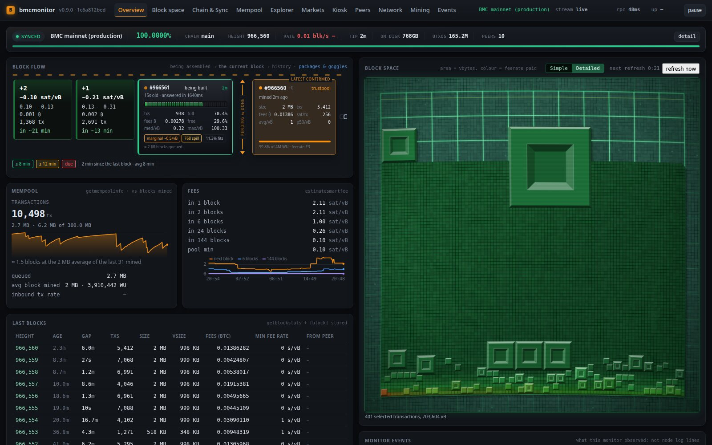

---

## The header

| Item | What it tells you |
|---|---|
| **BlockYard v… · build** | The version and build this tab is running. |
| **Tabs** | One button per page. The Admin tab appears only when accounts are enabled and you are signed in as an admin. The three games live at the end, under the **Diversions** pop-down. |
| **Node picker** | With one node configured, this is the node's name, with a dot coloured by its state. With several, it is a drop-down listing every node with its sync percentage, so you can see which one needs attention before you pick it. On first load the monitor opens on a node that is syncing, if there is one, and otherwise on the primary node. |
| **stream** | The live link to the server. `connecting` on load, then `live`. `reconnecting` means the link dropped and the browser is retrying. `stale` means the link is up but no fresh data has arrived for more than 90 seconds. |
| **rpc** | The node's last RPC round-trip time. It turns red when the average climbs above five seconds. |
| **up** | How long the monitor process has been running. |
| **open access** | Shown when the monitor runs without accounts. Anyone who can reach it reads it as a viewer. Hover for details. |
| **stale build — reload** | Shown when the server has been updated since you loaded the page. Reload to run the current code. |
| **pause / resume** | Freezes live updates so you can read a moving figure. Charts and panels stop updating and the Block space countdown shows `refresh paused`. **Shift-click** also freezes the event feed. Click again to resume. |
| **sign out** | Only present when accounts are enabled. |

A red bar under the header means the node is not answering RPC, or nothing has
arrived for the selected node. It says which, and makes clear that everything below
it is the last state received, not current data.

### The sync strip

The sync strip appears at the top of Overview and Chain & Sync. It has one row of
figures and a thin progress bar.

- **The bar's fill** is *blocks held ÷ announced headers*. It is the only figure that
  drives the fill.
- **The marker on the bar** is the node's own `verificationprogress`, which is
  difficulty-weighted. The two figures measure different things, so they are shown
  separately and never averaged.
- **The ETA** comes with the measured rate it was computed from. During initial block
  download there is no fallback based on the ten-minute block cadence, and a window
  with less than 60 seconds of history is refused. When the measurement windows
  disagree, the ETA is given as a range.
- **`detail`** expands the full derivation: height, headers, blocks behind, every rate
  window, the ETA and its basis, tip age, chain size, and every caveat in full.
  **`N notes · show`** does the same.
- **`also syncing`** buttons appear when another configured node is syncing. Click
  one to switch to it.
- **Stalled** is claimed only when the connected peers report a tip above the node's
  (`getpeerinfo`). A long gap with the peers agreeing on this tip stays **Synced**, with a
  caveat saying it is a gap on the network rather than a fault of this node. With no peer
  heights at all, the strip says Stalled only after two hours without a block, and the caveat
  says a long gap and a node cut off from its peers cannot be told apart yet.

---

## Overview

The landing page. It shows the most important panels from the other tabs in two
columns.

| Panel | What it shows |
|---|---|
| **Block flow** | The chain as a row of cards. See [Reading Block flow](#reading-block-flow). |
| **Block space** | The 3D block-space viewer: the same viewer as the [Block space](#block-space) tab, in a square panel. |
| **Mempool** | Transaction count, bytes and memory used against the limit, a one-hour sparkline, and the queue measured in blocks: "≈ N blocks at the average size of the last M mined". It divides by blocks actually mined, not by an assumed size. |
| **Fees** | `estimatesmartfee` targets for 1, 2, 6, 24 and 144 blocks, the pool's minimum fee, and a history chart. A target the estimator has no answer for reads `unset`. |
| **Last blocks** | Height (links to the explorer), age, the gap since the previous block (amber over 20 minutes, red over an hour), transaction count, size, vsize, fees, minimum fee rate, and the peer that served the block when that is known. |
| **Monitor events** | The newest events this monitor observed. These are the monitor's own observations, not node log lines. The full feed is on [Events](#events). |
| **Mined by** | Blocks in the recent window grouped by pool, from coinbase text and a curated label map. See [Mining](#mining). |
| **What this panel cannot tell you** | Every known data gap for this node, stated. If there are none, it says so. While the server is building the address index, one line here is its progress: the phase, blocks or files done of the total, rows so far, the time left, and `paused while the node's RPC is slow` when the build is holding back for the node. If a build fails, the line says so and gives the command to run by hand. |

### Reading Block flow

Block flow reads left to right, from the future into the past.

- **Projected blocks** (far left, dashed, labelled `+1`, `+2` …) are the mempool
  sorted by fee rate, with the block currently being built skipped and the rest cut
  into 1,000,000 vB blocks. Each card shows the median fee rate, the fee range, total
  fees, transaction count and an ETA from the measured average block interval. The
  last card (`+N…`) is the rest of the pool. These cards are inference, which is why
  they are dashed and flat. A child paying for its parent can show up one block late,
  because this node's mempool carries no ancestor data.
- **The block being built** sits just left of the divider. It shows the template's
  height, its age and how long the node took to answer, and a 40-segment meter that
  fills as weight is selected. Each lit segment is coloured by the fee rate of the
  transactions at that point in the block, richest first. The card also shows the
  transaction count, how full the block is, fees, free space, median and maximum
  fee rate, and chips for the marginal fee rate, the spill and how much of the pool
  fits. A **coloured ring** shows how long this block has been accumulating: green
  within the chain's measured average interval, amber beyond it, red once a block is
  due (1.5 times the average). The legend under the row gives the thresholds and the
  minutes since the last block. If the template is behind the tip, the card says
  `stale template`.
- **The divider** (`pending ⇆ done`) separates work in progress from work the network
  has accepted.
- **The chain tip and history** run to the right, linked like a chain, because every
  block commits to the one before it. Each card shows the pool, the height (click it
  to open the block in the explorer), how far behind the tip it is, when it was mined
  and the gap before it, size, transactions, fees, sats per transaction, average and
  median fee rate, and a fill bar against the 4,000,000 WU cap. A light block is
  visibly shorter than a full one. The tip has the accent-coloured ring. Hover a card
  for the coinbase text, the label that matched, the hash, and more.
- A card reading **`awaiting attribution`** or **`not attributed`** is a height whose
  coinbase has not been read yet. Attribution reads one block per poll, so it trails
  the tip. These cards are drawn as placeholders rather than skipped.

On first load the row scrolls so that the nearest projected blocks, the block being
built and the divider are all on screen. After that it keeps wherever you scroll it.
With `prefers-reduced-motion` set, the numbers stay and nothing animates.

---

## Block space

The block-space viewer at full size. Next to it are the block being built, the chain
tip and a colour legend.

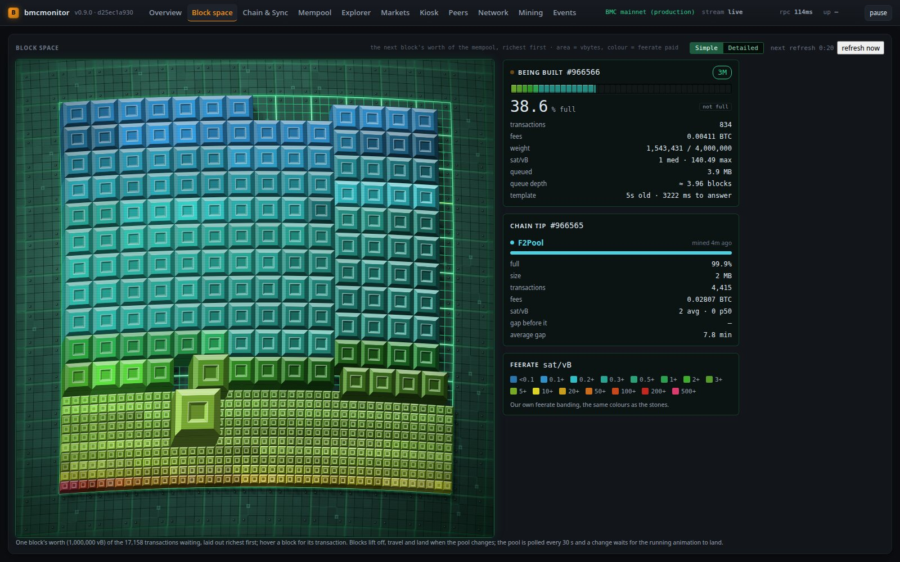

### What the board shows

The board shows **the next block's worth of the mempool**: the best-paying
transactions, up to one block (1,000,000 vB), laid out richest first on a 3D grid.

- **Area is vbytes.** Every transaction is a square whose side is a whole number of
  grid units, packed first-fit, richest first.
- **Colour is fee rate**, in 128 bands from under 0.1 to 2,000 sat/vB and over: sky blue for the
  cheapest, through teal, green, yellow, orange and red, to purple. The **Feerate** legend in
  the side panel gives the bands in sat/vB, from under 0.1 up to 500 and over.
- **Hover a block** for its transaction id, size and fee rate. Hover works when the
  board is at rest. While blocks are moving, their positions do not match their
  footprints, so the tooltip stays hidden instead of naming the wrong transaction.

### Refreshes and the control bar

The board refreshes every **30 seconds**, and a refresh is animated rather than
redrawn. Blocks rise off the grid, move to their new places in separate height lanes
so they never collide, and fall back under gravity with a few bounces. The board and
the camera stay fixed, so the view itself never moves. If a new layout arrives while
the animation is still running, it waits until the current one has landed.

The control bar in the corner of the panel has:

- **The countdown**: `next refresh m:ss`, with a fill that shows how much of the wait
  has passed. It shows `refreshing…` while a fetch is under way and `refresh paused`
  while updates are paused.
- **refresh now**: fetches immediately. It is enabled only when the board is at rest,
  updates are not paused and no refresh is already running. Hover it to see why it
  is disabled.
- **The mode switch**: see below.

### Viewer modes

| Mode | What it draws |
|---|---|
| **Simple** | The richest ~400 transactions as cubes, as tall as they are wide, with the rest of the block as equal smaller pieces. The best view for seeing which transactions dominate. |
| **Detailed** | Every transaction in the next block, one square each on a 96-unit grid, drawn as low slabs so that thousands of them stay readable. The best view for the block's texture. |

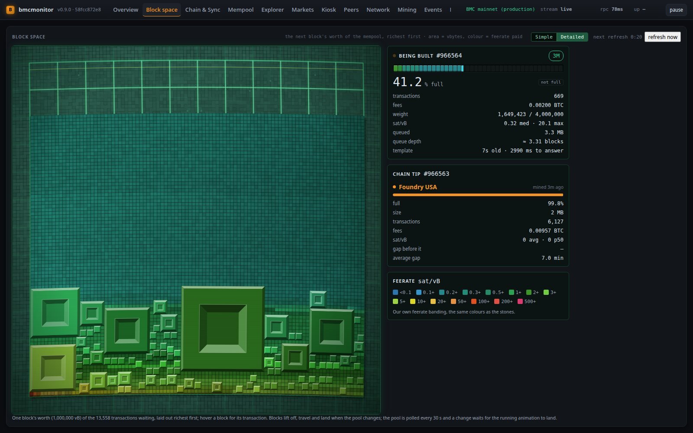

Your choice is remembered in this browser and applies to every Block space viewer:
Overview, Block space, Mempool, Mining and Kiosk. When you switch to Detailed, the Simple
picture stays on screen until the first full read arrives. Transactions present in
both modes move to their new places rather than disappearing and reappearing.

### Idle effects

While the board is at rest, one effect plays every seven to thirteen seconds — the first
about a second after the board lands — and never one that has played within the last twelve
(**No repeats within**, 0 up to the length of that board's list). There are **34**, and each has its own switch. **Each board
has its own list**: the Block space board's switches are the **Space effects** tab, the
Markets board's are the **Market effects** tab, and each tab has its own no-repeat window, so
trimming one board's effects leaves the other's alone.

| | |
|---|---|
| **Ripple**, **Outline sweep**, **Scan line**, **Tide** | fronts crossing the board: a spreading ring, traced edges, a curtain of light standing floor to top — a white core with soft cyan faces, raster rippling down it, a bar it hangs from, a glowing foot with a phosphor tail, motes in the beam — and a swell that lifts the cubes it passes under |
| **X-ray** | a front sweeps the board and everything behind it goes x-ray — bodies to glass, edges and a raster lit — then develops back to solid |
| **Cascade**, **Twinkle**, **Sparkle** | the blocks light in fee-rate order; scattered flashes; a constellation, each block its own colour |
| **Light cycles** | a TRON-style race in blue and orange from opposite edges, leaving light walls, until one crashes and de-rezzes |
| **Lightning ball** | a pale plasma ball entering from off-screen, tracing the grid, throwing bolts and trailing electrical dust |
| **Shockwave**, **Nova**, **Fireworks**, **Supernova** | a hard ring that throws blocks into the air; an implosion then a brighter blast; a fireworks display; a supernova — a star swells white-hot and crackles, blows out in a flash and a lens flare, a shockwave rings out, plasma is flung on every side, and a ring nebula expands and cools gold → red → violet round a white dwarf, lighting everything near it as it goes |
| **Wave**, **Quake**, **Checkerboard**, **Combo chain** | crests rolling across; the board shaking itself out; squares flipping against each other; a chain reaction down the diagonal |
| **Code rain**, **Radar**, **Vortex** | a drop falling down every column; a sweep hand with a phosphor tail; spiral arms draining inward |
| **Power-up**, **Aurora**, **Plasma** | the board charging from the floor up in gold; drifting curtains of colour; the demoscene plasma |
| **Centipede**, **Interception**, **Collapse** | a body that weaves down the board and splits in two; arcs raining down against interceptors rising to meet them; the board giving way from a point, cubes collapsing outward |
| **Tractor beam** | a UFO that draws the tallest transaction up into its beam, flies off with it and drops it back under gravity |
| **Ball lightning** | a plasma sphere in a nebula drifting across the whole view from off-screen to off-screen, a hazy white light on everything it passes, its arcs electrifying the blocks they strike and lighting where they land — and half the arcs chain on from the struck block to another as a green discharge, half of those on to a third; on Markets it flies through the chart, striking candles and charging the price line where it passes |
| **Energy pulse** | the surge that runs the neon price line on Markets: the pipe swells round its head and goes white-hot behind it, cooling back to the wire through hot gold, with a warm cloud, crackle and motes — nothing blue |
| **Breathe** | on Markets: the price line breathes, three slow swells from the plain wire to the pulse's white heat and back |
| **Light saber** | on Markets: the price line ignites from its left end as a light saber — blue, green, red or purple by the run — hums, spits sparks, and retracts |
| **Black hole** | on Markets: a point of darkness opens on the price line and grows; the line bends round it as through a lens, the candles nearest are swallowed, and an accretion disk in the chart's own colours spirals in round the shadow — brighter on the side coming toward you, its far side arched over the top and under the bottom, a photon ring hugging the horizon, starlight bent into arcs — until it shrinks away and lets everything go |
| **Pipe bulge** | on Markets: a ball forced through the price line, the tube swelling around it with a stretched skin; it enters at the line's start at the tube's own size, leaves at its end, and runs quicker downhill than up |

They are decoration only: they carry no data, they never play during a refresh, and they
are switched off entirely under `prefers-reduced-motion`. The Block space list is every effect
but the two drawn on a price line (**Energy pulse**, **Pipe bulge**). The Markets board is eight
units deep and as wide as the hours, so everything there moves **along the hours, left or right,
never toward you**, and lights the candles or the line. Its list is the **sixteen** that
translate to a chart: **Ripple**, **Outline sweep**, **Tide**, **Cascade**, **Twinkle**, **Scan
line**, **X-ray**, **Fireworks**, **Supernova**, **Wave**, and the price line's own **Energy pulse**,
**Pipe bulge**, **Breathe**, **Light saber**, **Black hole** and **Ball lightning** (a quarter of its
Block space size there). Fronts run along the
chart, rings start on the candle row, the candles light where they stand. Nothing on it waits
its turn: the pulse, the bulge and ball lightning are picks like any other, and how often you
see one is the length of the list you leave switched on.

The more you leave switched on, the less often you see any particular one — there is still
only one effect every seven to thirteen seconds. The **all off** button on that tab leaves
the board completely still without touching anything else.

### The side panel

- **Being built**: the template's height and a clock showing minutes since the last
  block (coloured like the Block flow ring), the 40-segment meter, the percentage
  full, the marginal fee rate, transactions, fees, weight, median and maximum fee
  rate, the queued bytes, the queue depth in blocks, and the template's age and cost.
- **Chain tip**: the pool that mined it and when, a fill bar, the percentage full,
  size, transactions, fees, average and median fee rate, the gap before it and the
  chain's average gap.
- **Feerate**: the colour legend.

---

## Chain & Sync

The chain in detail. The sync strip is at the top, followed by charts and state
cards three to a row.

| Panel | What it shows |
|---|---|
| **Block interval** | Seconds between blocks over the last 24 hours, with the 10-minute target marked. The note gives the median and how many gaps exceeded 20 minutes. |
| **Block size** | `getblockstats` `total_size`, the sum of transaction sizes, not the serialized block. The note says which basis applies. |
| **Fees per block**, **Transactions per block** | One point per block. |
| **Transaction rate** | `getchaintxstats` tx/s, with the window size, transactions in the window and the all-time count. |
| **Tip progression** | Blocks applied against announced headers. Once the node is synced this is a flat line. |
| **Chain state** | Chain, height, headers, best hash, tip time and age, progress, size on disk, pruned, chain work, IBD flag. |
| **UTXO set** | Coins, height, total amount and muhash, with a history chart. These are read only from a node whose `getindexinfo` reports a synced `coinstatsindex`; on any other node `gettxoutsetinfo` would walk the whole UTXO set every minute, so the card says the figures are unindexed instead. |
| **Difficulty & work** | Difficulty, estimated network hash rate, average interval and reorgs seen. During initial block download the hash rate is withheld and the card gives the reason. |
| **Block drill-down** | Type a height or block hash, or leave the box blank for the tip, and press **inspect** or Enter. It shows the header and statistics plus the block's txids as buttons. Click one to decode that transaction. Both views link into the explorer. |
| **Indexes** | Each index the node keeps, its height, and whether it is synced. |
| **Chain tips** | `getchaintips`: height, branch length, status. |

---

## Mempool

| Panel | What it shows |
|---|---|
| **Pool usage** | A gauge of memory used against `maxmempool`, next to the transaction count, serialized bytes, memory, limit, pool fees, minimum fee rate, minimum relay fee, unbroadcast count and the OP_RETURN size limit. |
| **Mempool size** | Transaction count (left axis) and memory (right axis) over time. |
| **Fee rate distribution** | A histogram of waiting transactions by sat/vB on a log scale. The green bar marks the pool's minimum fee rate. The note gives the median, 90th percentile and maximum. |
| **Block space** | The same viewer as the Block space tab, smaller, with the same modes and countdown. |
| **Fee rate vs age** | A sampled scatter of fee rate (log) against time in the pool. Dot area is proportional to vsize. Transactions reporting no entry time are left out and counted in the note. |
| **Age distribution** | How long transactions have been waiting. |
| **Fee estimates over time** | Estimates for 1, 2, 6, 24 and 144 blocks, and the pool minimum. |
| **Fields this node does not report** | The Core `getrawmempool` fields this node leaves out. They are listed by name, and not drawn as empty charts. |

---

## Explorer

A block, transaction and address explorer that reads directly from your node. Every
page has its own URL, so it can be bookmarked or shared.

| Route | Page |
|---|---|
| `#explorer` | Search box and the latest blocks |
| `#explorer/block/<height or hash>` | A block. Add `/<page>` for later pages of its transactions. |
| `#explorer/tx/<txid>` | A transaction |
| `#explorer/address/<address>` | An address. Add `/<page>` for later pages. |

### Search and the home page

Type a **block height, block hash, transaction id or address** and press Enter or
**Search**. If nothing matches, a message says so.

The home page shows the latest blocks as a row of **cubes coloured by median fee
rate**. Each cube shows the median and fee range, size, transaction count, age and the
pool that mined it. Below the cubes is a table of recent blocks with height, time
mined, pool, transactions, weight and fees. Click a cube or a height to open the
block.

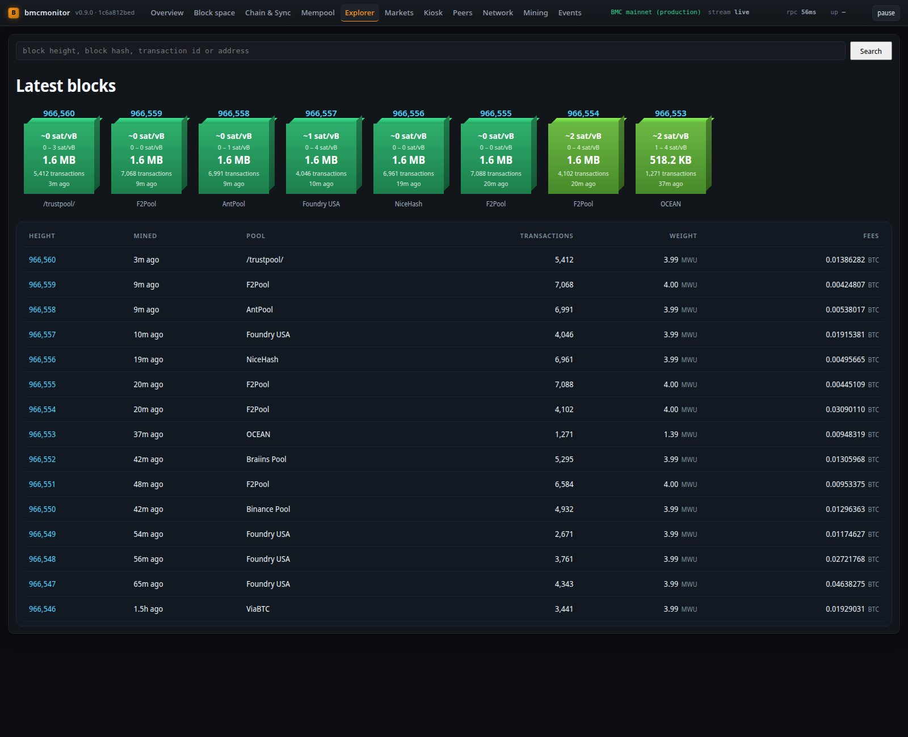

### Transaction page

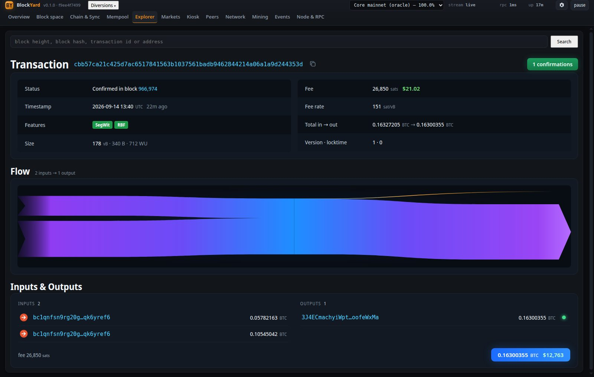

- **Title and status pill**: the txid with a copy button. The pill reads
  `N confirmations`, `Unconfirmed`, or `Stale — off the best chain`.
- **Summary panels**: status (the confirming block, which links to it, or "In the
  mempool"), timestamp, feature badges, size in vB, bytes and weight units, the fee
  and **fee rate**, total in and out, version and locktime. When the server has a
  recent spot price, dollar values appear next to BTC amounts **in green**. A coinbase
  transaction shows the block reward instead of a fee.
- **Feature badges**: **SegWit**, **Taproot**, **RBF**, **Consolidation**,
  **OP_RETURN**, and **coinbase** where it applies.
- **Flow**: a diagram of where the value came from and where it went. Each input is a
  band as thick as its share of the value, and the inputs merge into one trunk that
  fans out to the outputs. The fee leaves the trunk as a thin **gold stream**. A
  coinbase input glows gold, and an OP_RETURN output is a grey sliver. Each input band
  links to the transaction that created it, and each output band links to its address.
  Hover a band for its amount. A side with more than 24 entries folds the rest into
  one "N more" band.
- **Inputs & Outputs**: two columns. Each input has an **arrow button** to the
  transaction whose output it spends. Each output has an arrow button to the
  transaction that **spent** it, or a **glowing dot** if it is still unspent. OP_RETURN
  outputs are marked unspendable. A very large transaction lists its first outputs and
  says how many there are in total. The bar underneath gives the fee and total output.

### Block page

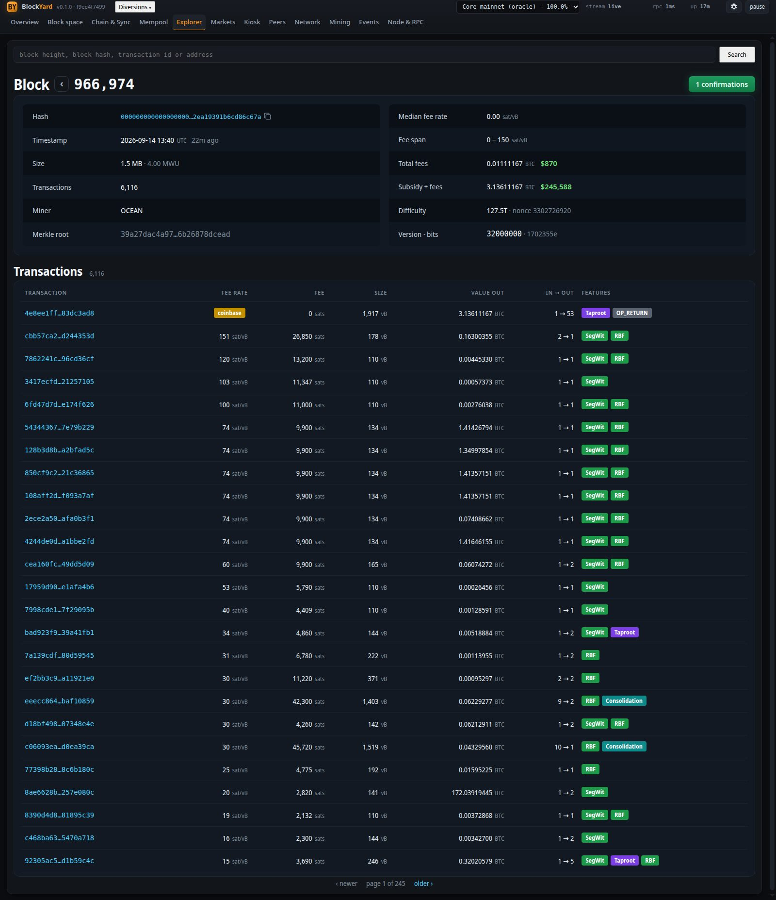

- **Header**: `Block <height>` with **‹** and **›** arrows to the previous and next
  block, and a confirmations pill.
- **Stats**: hash (with copy button), timestamp, size and weight, transaction count,
  miner, merkle root, median fee rate, fee span, total fees, subsidy plus fees (with
  dollar values when available), difficulty and nonce, version and bits.
- **Transactions**: a paged table with each transaction's fee rate, fee, size, value
  out, input and output counts, and feature badges. Use the pager at the bottom to
  move through the pages.

### Address page

The address with a copy button, its type, transaction count, then **balance**, **total
received** and **total sent**. Below that, its **transactions, newest first**, 25 a page,
with the block each one was confirmed in and the **change** it made to the balance, green for
money in and red for money out. A transaction the node could not return still shows its
height and amount, because those are the index's own.

**Where this comes from.** Bitcoin Core has **no address index at any setting** — the RPCs an
explorer would ask (`getaddressbalance`, `getaddresstxids`) belong to insight-style forks, and
Core answers `Method not found`. So BlockYard builds its own from the node's block and undo
files, one row per (address, transaction) with the net amount — **a few hours** for the whole
chain on the installer's default of four workers (30 minutes on 16, on NVMe) and 124 GB — and the
server keeps it current as blocks arrive. The server
builds a missing index itself, in the background, the first time it starts with an index
directory configured (`scripts/index-build.js` does the same by hand). Balances are checked
against the node's `scantxoutset` to the satoshi. See
[Building the address index](INSTALL.md#building-the-address-index).

**Received** and **sent** are sums of each transaction's *net* for the address, so a
transaction that both paid and spent it counts once, by its net — not the gross figures an
explorer that stores every output separately would show.

The page says when the index is **behind** the node (it catches up within a poll, 30 s) or
has **stopped following** — which happens after a reorganisation deeper than the blocks it
still holds in its tail, and means a rebuild.

**While the index is being built** (BlockYard builds a missing one itself when it starts), the
page reads **not indexed** and says so in a note with the phase, the progress, the rows so far
and the time left; the Overview's "what this panel cannot tell you" box shows the same line, and
adds `paused while the node's RPC is slow` whenever the build is holding back so the node keeps
answering. A notification appears in every open tab when the build starts, when it finishes and
if it fails; on finish the page fills in with no restart. The build does not resume after the
server is stopped: the next start begins it again.

**Without an index configured**, the address and its type are still confirmed
(`validateaddress` needs none), and balance, totals and history read **not indexed**. It does
not show zero, and it does not print the node's error where a figure belongs: nothing counted,
so nothing is claimed.

Below the transactions, the address's **unspent outputs** — each output that paid it and is still
in the node's UTXO set (less what the mempool already spends), with its block and value; the
**Unspent outputs** figure in the summary is their count. The list is made for an address with
up to 100 transactions; a longer history says `not listed` instead, and shows no count.

**Not yet:** the address's transactions still in the mempool.

**Requirements:** transaction pages rely on the node's transaction index (`txindex=1`), which
Core supports.

---

## Markets

The BTC/USD price from five exchanges' public APIs. **Polling is off by default**: out of
the box the monitor makes no outbound connection but to your node, and Markets and Kiosk say
so. Tick **Display settings → Markets & Price → Enable market polling** — one switch for
every screen of this monitor, no restart needed. With it on, the server fetches market data
**only while someone is reading it** — the Markets or Kiosk tab, or Overview, whose price line
(**Display settings → Markets & Price → Price line on Overview**) reads the same feed — and
stops about ten minutes after the last request. Switch that line off and, with no one on
Markets or Kiosk, the monitor makes no exchange requests at all.

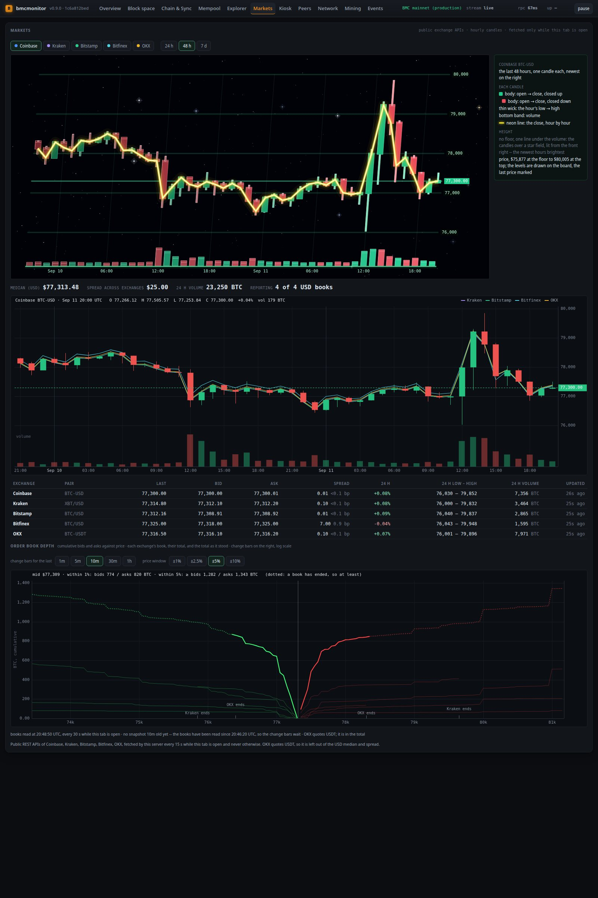

### The price chart

The price panel draws the selected exchange's **hourly candles** in one of two views,
chosen with the **2D / 3D** buttons in the toolbar and remembered (**Display settings →
Markets & Price → Price view**). **2D**, the default, is the flat candlestick chart
described below. **3D** draws the same hours on the same 3D engine as Block space, from a
low camera looking at the chart from the side.

- Each hour is a candle **floating at its price**. The body runs from open to close
  (green if the hour closed up, red if down) and a thin wick runs from the hour's low
  to its high.
- A steady **neon-yellow line** joins each hour's close.
- The **volume** band runs along the bottom.
- **Price levels and hours are labelled on the board**, with the last price
  highlighted.
- The background is a star field. The lighting comes from the front right, so the
  newest hours are brightest and older hours are dimmer.
- **Hover a candle** for its exchange, hour, open, high, low, close, change and volume.
- The legend beside the board gives the price range from floor to top.

The board shows at most the last 72 hours; the flat chart covers the full selected
range.

### Controls and summary

- **Exchange buttons**: Coinbase, Kraken, Bitstamp, Bitfinex, OKX. Only exchanges
  with candle data are listed. The selected exchange provides the candles, and the
  others appear on the flat chart as lines.
- **Range**: **24 h**, **48 h** or **7 d**.
- **View**: **2D** or **3D**. One at a time; they draw the same hours.
- **Summary strip**: the **USD median** across books, the **spread across
  exchanges**, **24 h volume**, and how many USD books are reporting.

### The flat candlestick chart

A conventional price chart with the price axis on the right, the time axis in UTC
(midnights carry the date), candles, volume, and a dashed line at the last price.
The other exchanges are thin coloured close lines, named at the top right. Move the
pointer over it for a **crosshair** and an **OHLC readout** of that hour at the top
left. The readout shows the latest hour when the pointer is elsewhere.

### The exchange table

One row per exchange: pair, **last**, **bid**, **ask**, **spread** (in dollars and
basis points), **24 h change**, 24 h low–high **range**, 24 h **volume**, and when it
last updated, or the exchange's **error** if it did not answer.

### Order book depth

Cumulative order-book depth against price, read every 30 seconds while the tab is
open.

- **Bids** (green) accumulate downward from the best bid. **Asks** (red) accumulate
  upward from the best ask. Each exchange's book is a faint line, and the **total**
  across all books is the bright line.
- The **dashed line** is the total as it stood N minutes ago.
- **Change bars** show how much was added (blue) or pulled (orange) at each price
  since then, on a **symmetric-log** axis on the right.
- **Pickers**: `change bars for the last` **1m / 5m / 10m / 30m / 1h**, and `price
  window` **±1% / ±2.5% / ±5% / ±10%**.
- **Shallow books** end where the exchange's book ends, marked `<exchange> ends`.
  Beyond that point the total still counts what that book had reached, so the total
  there is a **lower bound** and is drawn **dotted**. The readout says "at least".
- With the pointer off the chart, the readout at the top gives the mid price and the
  bids and asks within 1% and 5%. Move the pointer to read the cumulative depth,
  the change at that price, and each exchange's figure there.
- Until a snapshot of the chosen age exists, the note says the change bars are
  waiting.

**OKX quotes USDT, not USD**, so it is left out of the USD median and the
cross-exchange spread. It is included in the depth total.

---

## Kiosk

A wall display. Four panels fill the screen: the **3D Markets board**, a **Price &
order book depth** panel, the **Block space** board and **Block flow**.

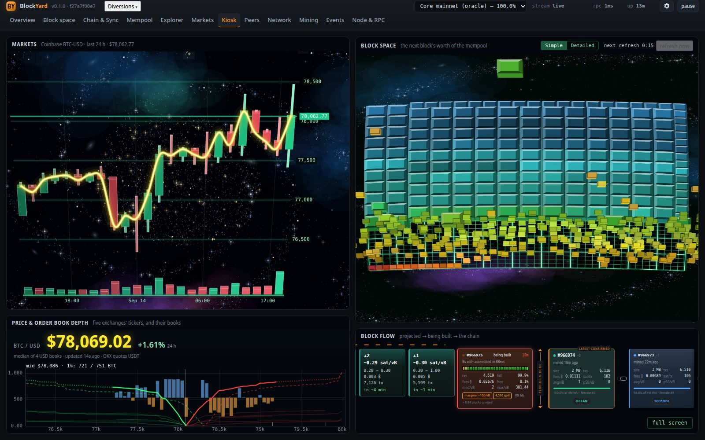

- **Markets** is the same 3D board as the Markets tab. Its title names the exchange,
  pair, hours shown and last price.
- **Price & order book depth** shows the **USD median** in neon yellow with its 24 h
  change and how recently the data updated, and under it the **order book depth chart**:
  cumulative bids in green and asks in red against price, every exchange's book faintly
  and their total brightly, fixed at ±2.5% around the mid. The 24 h high, low, volume,
  spread and the per-exchange table are deliberately *not* here — a wall display is read
  from across a room, where a four-column table is unreadable and the shape of the book
  says more than a spread figure. All of that is still on the **Markets** tab.
- **Block space** is the same viewer as everywhere else, with its countdown,
  **refresh now** button and mode switch.
- **full screen** in the corner puts the kiosk into browser full screen. Press it
  again or Esc to leave.

Having the Kiosk open counts as viewing Markets, so exchange data keeps flowing while
it is on screen.

---

## Tetrust

A playable Tetris, built on the same 3D engine as everything else, under **Diversions** at the end
of the nav — *trust, but verify*: every line you clear is a block you verified. The well is the block-space board, the pieces
are the same stones, and the sky behind them is the same turning galaxy.

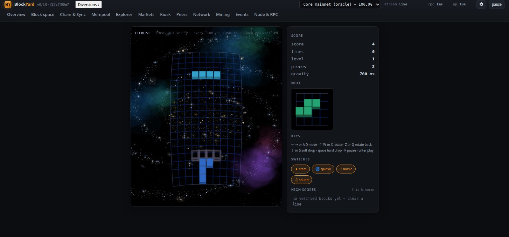

### Playing

| Keys | |
|---|---|
| **←** **→** or **A** **D** | move left and right |
| **↑**, **W** or **X** | rotate |
| **Z** or **Q** | rotate the other way |
| **↓** or **S** | soft drop (one row, one point) |
| **space** | hard drop (straight down, two points a row) |
| **P** or **Esc** | pause and resume |
| **Enter** | start, or resume when paused |

A wireframe on the floor of the well shows where the falling piece will land — neon blue until
you change it under **Display settings → Tetrust → Landing marker**. Cleared lines fly up off the
top of the screen.

**It pauses when you look away** — another browser tab, or another tab of this monitor —
and waits on a **resume** button, so a game is never lost to reading the Mempool page.

### Scoring

The classic table, multiplied by the level: **100 / 300 / 500 / 800** for one, two, three or
four lines at once. Four at once is worth well over four singles, which is the whole reason
to leave a column open and wait for the long piece. Soft drops pay a point a row, hard drops
two. Every ten lines is a level, and each level drops the pieces 65 ms a row faster, down to
a floor of 80 ms.

**High scores** are kept in your browser — top ten, with the lines, level and date. Nothing
is sent to the server, and they are not shared between browsers or machines.

### The switches on the panel

Four buttons under the score, which are the same settings as **Display settings → Tetrust**,
so a change in either place shows in both:

| | |
|---|---|
| **★ stars** | the star field across the whole panel |
| **🌀 galaxy** | the spiral galaxy in it, turning |
| **♪ music** | Korobeiniki, the folk tune everyone knows as the Tetris theme, synthesised in the browser with oscillators — there is no audio file to download |
| **♫ sound** | move, rotate, drop, lock, line clear, level up and game over |

Browsers only allow sound to start after you interact with the page, so the music begins
when you press **play**, not when the tab opens.

---

## Blockout

Breakout, on the same 3D engine, under **Diversions** at the end of the nav. The wall is made of
block-space stones — one grid cell each, so a brick *is* an engine tile — and the panel behind it
is the same turning galaxy as everywhere else. The ball is drawn round rather than as a block.

### Playing

**The bat follows your mouse.** Move the pointer across the court and the bat goes where it is;
click to serve. If you would rather use the keyboard, **←** **→** or **A** **D** move it and
**space** serves.

| Keys | |
|---|---|
| **mouse**, **←** **→**, or **A** **D** | move the bat |
| **click** or **space** | serve the ball |
| **P** or **Esc** | pause and resume |
| **Enter** | start, or resume when paused |

Like Tetrust, it pauses when you look away — another browser tab, or another tab of this monitor.

### Scoring

Where the ball lands on the bat decides where it goes: dead centre sends it straight up, the edges
fire it off at an angle. That one rule is what makes Breakout a game of aim rather than reflexes,
and it is worth practising on purpose.

The wall is six rows, cheap at the bottom and dear at the top — **1, 1, 3, 3, 5, 7** points a
brick — so the reward for digging a channel up one side and letting the ball loose in the roof is
the same as it was in 1976. You get **three balls**; clearing the wall starts the next level with a
faster ball and your score kept. High scores are kept in your browser, top ten, and are not sent
anywhere.

### The switches on the panel

**★ stars** and **🌀 galaxy** for the sky behind the court, **◉ neon** to draw the wall, the bat and
the ball as dim bodies under lit tubes, and **♫ sound** for the bat, the bricks, the walls and a
lost ball. They are the same settings as **Display settings → Blockout**, so a change in either
place shows in both; the colour and brightness of the neon live on that tab.

---

## Blockanoid

Arkanoid, on the same 3D engine, under **Diversions**. Blockout with the arcade's own ideas put
back: a different wall every level, bricks that survive being hit, and capsules that fall out of
what you break. The court is narrower and taller than Blockout's, which is what gives you room to
dig a channel up the side.

### Playing

**Vaus follows your mouse.** Click to serve, or use **←** **→** / **A** **D** and **space**. The
laser, once you have caught it, **fires itself**.

| Keys | |
|---|---|
| **mouse**, **←** **→**, or **A** **D** | move Vaus |
| **click** or **space** | serve the ball |
| **↑**, **W**, or **right-click** | fire early — the laser fires on its own anyway |
| **P** or **Esc** | pause and resume |
| **Enter** | start, or resume when paused |

### The wall

Three kinds of brick, and telling them apart is most of the game:

| Brick | What it does |
|---|---|
| **Coloured** | Breaks in one hit and pays by colour, 50 for white up to 120 for yellow. |
| **Silver** | Takes **two** hits, and one more every four levels. It starts dark and **lightens with every hit**; at its lightest, the next strike breaks it. It sinks as it wears, too, so the cue survives a screen you cannot read colour on. Pays 50 times the level. |
| **Gold** | Never breaks and pays nothing. It is scenery — a wall is cleared when the breakable bricks are gone, so gold never traps you. |

Six walls ship, and past the sixth they cycle with tougher silver each time.

### Capsules

A broken brick may drop one, and only **one is on the court at a time** — which is what makes
taking it a decision rather than a reflex. Catch it with Vaus. Every capsule pays 1000 points.

**Nothing lasts for ever.** Laser, wide, catch and slow each run for **30 seconds**, and the
heads-up display counts each one down. Three balls and the extra life are one-shot — they have
nothing to expire. Losing a ball, or a minion reaching Vaus, clears everything you were carrying.

| | Capsule | What it does |
|---|---|---|
| **L** | Laser | Vaus turns red and can shoot. The bat itself tells you what it can do. |
| **E** | Enlarge | A wider Vaus. |
| **C** | Catch | The ball sticks where it lands and **rides the bat** as you move — it does not drift while the bat slides under it. Serve it again when you have aimed. When the 30 seconds run out, a ball still held is released rather than left sitting there. |
| **S** | Slow | Takes the pace off the ball already in play. |
| **D** | Disrupt | Three balls at once, all at the same speed. |
| **P** | Player | An extra life. |

Laser and Catch put each other away: Vaus does one thing at a time. **The laser fires by itself**
while it is up — you caught it, you should not also have to hold a key down. Losing a ball, or a
minion reaching Vaus, puts Vaus back to stock.

### The minions

Four kinds of shape drift down the court, each with its own silhouette and its own way of moving —
a swinging cone, a tumbling cube, a wobbling orb, a zig-zagging molecule.

They **cannot pass through bricks**. On a solid wall they pace along the top hunting for a way
down, so breaking the wall opens their path as well as yours. The ball and the laser destroy one for
200 points, and the ball **bounces off** it rather than carrying on through — drop onto one from
above and you come straight back up. But **a minion that reaches Vaus costs you a life**. Turn them
off in the settings if you would rather practise.

### Scoring

Where the ball lands on Vaus decides where it goes, exactly as in Blockout. You get **three
balls**; clearing a wall starts the next with a faster ball and your score kept. High scores are
kept in your browser, top ten, and are not sent anywhere.

### The switches on the panel

**★ stars**, **🌀 galaxy**, **◉ neon** and **♫ sound**, as in Blockout. **Capsules** and **minions**
have switches too, on **Display settings → Blockanoid** — and because those two change the rules
rather than the look, flipping them reaches the game you are playing, not just the next one.

---

## Scorched Yard

Scorched Earth, the 1991 DOS artillery game, on the block engine: a landscape of dirt cubes that
craters and falls, tanks that aim by angle and power, wind, and a round that ends when one tank is
left. Under **Diversions**, after Blockanoid. You play against two computer opponents out of the
box (**Display settings → Scorched Yard → Computer players** fields up to five).

The rules are the original's (docs/PLAN-SCORCHED-YARD.md is the whole plan): the manual's roster
of thirty-three weapons and eleven accessories at the manual's prices, packs and blast radii,
craters, falling dirt, fall damage, death and its blast, the walls, wind, cash for damage and
kills, a shop between rounds, and a game of rounds. One computer
personality so far — the Moron, who fires at random and shops the same way; the others and the
fabulous part are on their way.

### Playing

| Keys | |
|---|---|
| **←** **→** or **A** **D** | the barrel's angle, a degree at a time (Shift: five) |
| **↑** **↓** or **W** **S** | power, ten at a time (Shift: one, Ctrl: a hundred) |
| **[** **]** or **PgUp** **PgDn** | the weapon, through what you own |
| **space** or **Enter** | fire |
| the mouse | drag on the field to aim: the direction from your tank is the angle, the distance the power |
| **A** **D** | drive a cell left or right, a unit of fuel each |
| **B** | a battery: 30 health back |
| **S** | raise a shield (the best you own) |
| **T** **H** | arm a contact trigger or heat guidance for the next shot |
| **P** or **Esc** | pause |
| **N** | the next round, from the shop |

### The roster

You start with the bottomless **Baby Missile** and your cash; everything else is bought. What a
shell does when it lands:

| weapon | what it does |
|---|---|
| Baby Missile, Missile, Baby Nuke, Nuke | a blast: a crater and damage that falls off with distance, from a cell and a half across to eleven |
| Leap Frog | three warheads, one after another, each blast bigger than the last |
| Funky Bomb | a blast, then six bomblets thrown out that each blast where they land |
| MIRV, Death's Head | five (or nine, large) warheads splitting at the top of the arc |
| Tracer, Smoke Tracer | no crater and no damage: it shows you the wind |
| Baby Roller, Roller, Heavy Roller | lands and rolls downhill until it meets a tank or the bottom of a dip, then blasts |
| Riot Charge, Riot Blast | a wedge of dirt cut from the turret along the barrel's line, at once; nobody hurt |
| Riot Bomb, Heavy Riot Bomb | a shell that clears a sphere of dirt and hurts no one |
| Dirt Clod, Dirt Ball, Ton of Dirt | a shell that bursts into a ball of dirt |
| Liquid Dirt | oozes downhill and sets where it pools, filling the holes |
| Dirt Charge | a wedge of dirt thrown from the turret, at once |
| Earth Disrupter | every hanging piece of dirt on the field settles, at once |
| Napalm, Hot Napalm | liquid fire that runs downhill along the surface and burns what it reaches |
| Baby Digger, Digger, Heavy Digger | digs straight down, then blasts |
| Baby Sandhog, Sandhog, Heavy Sandhog | tunnels on along its heading through the dirt, then blasts |
| Plasma Blast | energy thrown from your own tank, its reach set by the power; you are spared, no crater |
| Laser | a straight line from the barrel, at once: dirt along it goes, a tank on it burns |

The accessories: **Shield**, **Force Shield** and **Heavy Shield** absorb 60, 100 and 150 damage;
a **Mag Deflector** pushes passing shells away and a **Super Mag** harder and from further; a
**Parachute** opens when you fall; a **Battery** restores health; **Auto Defense** raises a shield
for you as your turn begins; a **Fuel Tank** lets you drive; a **Contact Trigger** sets the shell
off within reach of a tank before it buries; **Heat Guidance** bends the shell toward the nearest
tank as it falls. The items line under the fire button shows what you carry and what is armed.
Prices, packs and radii are the manual's (SCORCH.DOC); the original started every player with $0
and 5% interest, which the settings allow.

### Cash and the shop

Every point of damage you land earns $10, a kill $2,000, and the last tank standing $1,000; interest
(a setting, 5% out of the box) is paid on what you keep between rounds. When a round ends the
**shop** opens: every weapon and item with its price and pack size, what you own, and a buy button
while you can afford it. The computer players shop at the same moment, in their own way. What you
buy stays with you for the rest of the game.

The HUD shows whose turn it is, the round, the **wind** (an arrow and its strength: it changes
every turn, and it bends every shot), your angle, power and weapon with its count, and every
tank's health. **Fire** on the HUD does what space does. A shell that lands carves a circle out of
the dirt; the dirt above the crater falls until it rests, and a tank left in the air falls with
it and is hurt by the fall. A blast hurts every tank in reach, most at its centre. A tank at zero
health explodes, and its blast can take a neighbour with it.

A round ends when one tank is left (or none); the survivor scores 200, a kill 100, and a tank
that kills itself loses 50. **Rounds** (a setting, five out of the box) make a game; the highest
score at the end wins, and your score goes in the high-score table, this browser's.

### The switches on the panel

**Stars** and **galaxy** are the sky behind the field (its make-up is the **Sky** tab's). **Sound**
is the shot, the blast, a hit, a fall, a death. **Fast** flies shells at three times the pace.
The rules the original exposed are in **Display settings → Scorched Yard**: the number of
computer players, the rounds, the **walls** (none loses a shell off the edge, the original's
default; concrete explodes it there; padded stops it and drops it; rubber bounces it; spring
bounces it back harder; wraparound brings it in the other side), the **wind** (every turn, every shot,
or none), **gravity**, the **landscape** the rounds are drawn from (hills, mountains, a valley,
flat), the **starting cash** and the **interest** rate. They take effect at the next new game.

## Wolfenstein 3D

The shareware episode of Wolfenstein 3D, **Escape from Wolfenstein**, under **Diversions**, first of
the three DOS games. It is id Software's own `WOLF3D.EXE` v1.4 and its `.WL1` data files, unmodified,
on the same PC BlockYard emulates for DOOM and Quake. Where those two were 32-bit programs, Wolfenstein
3D is a 16-bit **real-mode** DOS program from 1992, so here the emulated processor runs the way a PC
started up: segments and offsets, DOS's own memory, the interrupt table at the bottom of memory. AdLib
music plays on the sound card's OPL and the digitised effects ("Achtung!") on its DSP. It draws at 70
frames a second, the VGA's refresh rate, with plenty of machine to spare.

Press **play**. The sign-on screen shows what the game found (memory, mouse, Sound Blaster); press a
key, the title and the demos follow, and **Enter** or **Esc** brings up the menu: **New Game**, pick
the episode and how tough you are.

### The files

The game's files live on the server in `games/wolf3d_dos/`: `WOLF3D.EXE`, and the eight `.WL1` files
it cannot start without (`AUDIOHED`, `AUDIOT`, `GAMEMAPS`, `MAPHEAD`, `VGADICT`, `VGAGRAPH`,
`VGAHEAD`, `VSWAP`). `CONFIG.WL1`, its settings and high scores, is optional. The page names a missing
file instead of starting.

### Playing

**Click the screen to capture the mouse**: moving it forward and back walks, left and right turns,
the left button fires. **Esc** gives the mouse back. The keys are the game's own:

| Keys | |
|---|---|
| **↑** **↓** | walk |
| **←** **→** | turn |
| **Alt** + **←** **→** | strafe |
| **Ctrl** or left click | fire |
| **Space** | open doors, push walls |
| **Shift** (held) | run |
| **1**–**4** | knife, pistol, machine gun, chain gun |
| **Esc** | the menu |
| **F8** / **F9** | quick save / quick load |

Rebind them under **Change View** and **Control** in the game's own menu; it keeps what you choose.

### Pausing, saving, quitting

Exactly as DOOM: it **pauses when you look away** with the machine stopped dead, **savegames, the
settings and the high scores stay in this browser**, and **Quit** ends the program the way it ended
in DOS, with a **play again** button.

### The switches on the panel

**♫ sound**, **◌ smooth** and **⛶ full screen**, as in DOOM. In full screen a tap of **Esc** is the
game's menu, not the browser's exit; leave with the **exit full screen** button in the top corner,
or hold **Esc** for a second.

---

## DOOM

If anyone asks *"well, can it run DOOM?"*, the answer is an emphatic **"Naturally. What sort of AI
slop generator do you take me for?"**

The shareware episode of DOOM, **Knee-Deep in the Dead**, under **Diversions**. Not a remake: it is
id Software's own `DOOM.EXE` v1.9 and `DOOM1.WAD`, unmodified, running on a 486 PC that BlockYard
emulates in your browser — the processor, DOS and its memory extender, the VGA card and a Sound
Blaster, all written in JavaScript. It plays exactly as it did in 1993, demos, sound effects, OPL
music and all.

Press **play**. The machine boots (you will see DOOM's own start-up screen for a moment), the
demos start, and **Esc** opens DOOM's menu: **New Game** from there.

### The files

The game's files live on the server, in `games/doom_dos/` beside the application — the shareware
package the operator put there. Without `DOOM.EXE` and `DOOM1.WAD` in that directory the page
says which file is missing instead of starting. Nothing is downloaded from anywhere else.

### Playing

**Click the screen to capture the mouse**: moving it turns, the left button fires, the right
strafes, the middle walks forward. **Esc** gives the mouse back (and opens DOOM's menu). The keys
are **WASD** by default:

| Keys | |
|---|---|
| **W** **S** | walk |
| **A** **D** | strafe |
| **←** **→** | turn |
| **E** | open doors, press switches |
| **Ctrl** or left click | fire |
| **Shift** (held) | run |
| **1**–**7** | choose a weapon |
| **Tab** | the map |
| **Esc** | DOOM's menu |
| **F2** / **F3** | save / load |
| **F5** | detail · **F11** gamma |

Turn the **⌨ WASD** switch off for DOOM's own 1993 keys: **↑** **↓** walk, **Alt** + **←** **→**
strafe (or **,** and **.**), **Space** opens. The switch applies **at once**, in the middle of a
game — the page rewrites the running game's key settings — and DOOM saves whichever you chose
when you quit.

### Pausing, saving, quitting

**It pauses when you look away** — another browser tab, or another page of the monitor — and the
emulated machine stops dead: its clock stops with it, so nothing moves while you are gone. Press
**resume** to carry on.

**Savegames and settings stay in this browser.** DOOM's six save slots, and the configuration it
writes when you quit (volumes, screen size, detail), are kept in the browser's storage and come
back the next time you play — on this browser only; they are never sent to the server.

**Quitting** from DOOM's menu ends the program the way it ended in DOS: the text-mode ENDOOM screen,
and a **play again** button.

### The switches on the panel

| Switch | |
|---|---|
| **♫ sound** | The Sound Blaster, on or muted. |
| **⌨ WASD** | W A S D and E (the default), or DOOM's own keys; applies immediately. |
| **◌ smooth** | Smooths the 320×200 picture instead of showing its square pixels. |
| **⛶ full screen** | The screen alone. In Chrome it also keeps **Esc** for DOOM's menu, so leave with the **exit full screen** button in the top corner, or hold **Esc** for a second. |

The **Machine** panel says what the PC is doing: running or paused, how fast the emulated
processor is going (in millions of instructions a second), how many frames reach the screen, and
the sound card's rate. DOOM draws at most 35 frames a second, as it always did.

If the sound will not start, the page may be served over plain HTTP from a LAN address: the browser
refuses its low-latency audio there, and DOOM falls back to a simpler path that works everywhere
but can crackle when the machine is busy.

---

## Quake

The shareware episode of Quake, **Dimension of the Doomed**, under **Diversions**, after DOOM and on
the same emulated PC. Again the real thing: id Software's `QUAKE.EXE` v1.06 and `PAK0.PAK`,
unmodified. Quake asked a lot more of a PC than DOOM did — a Pentium and a maths coprocessor — so it
is the harder test of the machine. It plays at **forty to fifty frames a second** — better than the
Pentium it was written for managed in 1996.

Press **play**. The first start downloads the 18 MB PAK file from the server (after that the
browser revalidates it rather than fetching it again), the console scrolls past, the demos start,
and **Esc** opens Quake's menu: **Single Player → New Game**.

### The files

The game's files live on the server in `games/quake_dos/`: `QUAKE.EXE` and `ID1/PAK0.PAK` are the
two it cannot start without. The page names a missing one instead of starting. Quake's CD music was
never part of the shareware download, so there is none; the sound effects play through the Sound
Blaster.

### Playing

**Click the screen to capture the mouse.** Quake starts with **mouse look** on and the keys a later
game taught everyone:

| Keys | |
|---|---|
| **W** **S** | walk |
| **A** **D** | strafe |
| mouse | look and turn |
| left click or **Ctrl** | fire |
| **Space** or right click | jump |
| **Shift** (held) | run |
| **1**–**8** | choose a weapon |
| **Esc** | Quake's menu |
| **−** / **=** | a smaller or bigger view |
| **~** | the console |
| **F6** / **F9** | quicksave / quickload |

Those are set the first time only. Change anything in Quake's own **Options → Customize controls**,
and Quake saves your bindings when you quit; the page never overwrites them again.

**A smaller view runs faster.** Quake starts with its view a little inside the screen, a border
round it. Quake only draws the 3D world inside that view, so **−** makes it smaller and faster and
**=** makes it bigger, up to the whole width; Quake keeps your choice. Measured on this machine's
emulator, a smaller view is worth about a tenth more speed at the starting size, and a quarter or
more below that.

### Pausing, saving, quitting

Exactly as DOOM: it **pauses when you look away** with the machine stopped dead, **savegames and
Quake's config stay in this browser**, and **Quit** ends the program the way it ended in DOS, with
id's order screen and a **play again** button.

### The switches on the panel

**♫ sound**, **◌ smooth** and **⛶ full screen**, as in DOOM (and the same two ways out of full screen).

---

## Peers

| Panel | What it shows |
|---|---|
| **Connections** | The current count, split into inbound and outbound, plus any connection budget and ban figures the node reports. Anything it does not report is labelled as such. |
| **Connection history** | Inbound, outbound, total and relaying peers over 24 hours. |
| **Peers** | The `getpeerinfo` table, refreshed every 15 seconds while the tab is open and sorted by bytes received, most first. Columns: direction, address and network, client (user agent, protocol version, and service badges such as `v2`, `filters`, `pruned`, `bloom`), time connected, last receive and send, bytes received and sent with their current rates, height, clock offset, and whether the peer relays transactions or only blocks. |

If the node reports connections but `getpeerinfo` returns no rows, the page says so.
Peer identity is not guessed from another source.

---

## Network

| Panel | What it shows |
|---|---|
| **Throughput** | Network-in and disk-write rates with a chart. |
| **Upload** | What the node reports about its byte counters. If a direction is not measured, the card says so and explains why, rather than charting a zero. |
| **Traffic accounting** | Cumulative received and written totals, averages since start, and the chain's size on disk. |
| **Where each number comes from** | The source table for every panel. |

---

## Mining

The block under construction and who has been mining. The layout follows mempool.space's mining dashboard: Block flow across the top, then two columns — reward stats and the difficulty adjustment, the pools and the hashrate, recent blocks and the adjustments — and our own panels beneath. **View more »** on the pools, hashrate, recent blocks and adjustments cards opens that card full screen (Esc, the close button or a click outside shuts it).

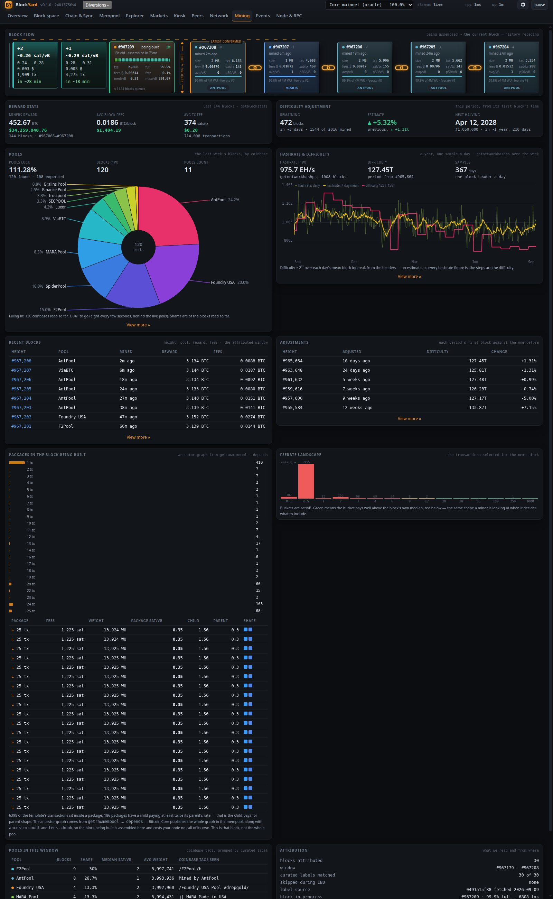

| Panel | What it shows |
|---|---|
| **Reward stats** | The last 144 blocks: the miners' reward (subsidy plus fees), the average fees per block and the average fee per transaction, from `getblockstats`, rolled forward a block at a time. Each carries its dollar figure while market polling is on (the cached spot price, never a new poll); off, a note says so. |
| **Difficulty adjustment** | Blocks remaining in the current period and when it ends at the pace so far, the estimated change (the pace projected over the period against the ten-minute target, within the protocol's factor-of-four bounds), the previous change, and the next halving's height and date. |
| **Pools** | The last week's blocks by pool, as a donut with its legend: luck (blocks found against the 1,008 the target spacing would give), the block count and how many pools. Every coinbase of the week is read from the node, eight every few seconds behind the live polls, and the note says how far that has got. |
| **Hashrate & difficulty** | The week's hashrate from `getnetworkhashps` and the current difficulty, and a year's chart: one block header a day gives that day's mean interval, and difficulty × 2³² over it is the day's hashrate estimate (the thin line), with a seven-day mean over it and the difficulty's steps on the right axis. |
| **Recent blocks** | The attributed window newest first: height (a link to the explorer), pool, when it was mined, the reward (the height's subsidy plus its fees) and the fees. Eight on the card, the whole window under View more. |
| **Adjustments** | The last periods: the first block's height, when, the difficulty and its change from the period before. Six on the card, a year under View more. |
| **Block flow** | The same Block flow as on Overview. |
| **Packages in the block being built** | The ancestor graph from `getrawmempool … depends`: a histogram of package sizes, then a table of the top packages with fees, weight, package fee rate, child and parent fee rates, and a small picture of the package's shape. Rows with a child paying at least twice its parent's rate are highlighted as child-pays-for-parent. If every transaction stands alone, the panel says so. That is a real reading, not a missing chart. |
| **Feerate landscape** | The template's transactions bucketed by sat/vB, with green buckets well above the block's median and red ones below it. |
| **Pools in this window** | Blocks per pool, share, median fee rate, average weight, and the coinbase tags seen. A pool the curated label map does not recognise is marked `unlabelled` and shown by its raw tag. |
| **Attribution** | How many blocks have been attributed, the height window, how many labels matched, where the label map came from, and the cost of the block template. |
| **Detailed** (click to expand) | What this node can and cannot answer about mining, and why. |

The block template is requested only while a page that shows it is open, because
answering it takes the node over a second of its single RPC thread.

---

## Events

The monitor's own event stream: what it observed and decided, such as blocks stored,
reorgs, stalls and nodes becoming unreachable. Node log lines are not shown here. Events of
kind `index` mark the start, finish or failure of an address index build; those three are also
shown as a notification in every open tab, because a build takes half an hour.

- **Filter text** matches the event text, tag, kind and address.
- **Severity** (`info`, `warn`, `error`) and **kind** drop-downs narrow the list.
- **clear** empties the local buffer. This affects only your browser, not the server.
- The count shows how many events match out of how many are buffered.

---

## Node & RPC

How the monitor treats your node, and where every number comes from.

| Panel | What it shows |
|---|---|
| **RPC etiquette** | The endpoint, calls per second, totals, batches, latency (last, average, slowest), how busy the RPC lane is, errors and timeouts, polls dropped as stale, circuit-breaker trips, and the queue. The monitor keeps one request in flight at a time, because the node's RPC server handles one connection at a time. |
| **Poll cadence** | Each polling tier's configured interval against its actual interval. If the node is slow, tiers deliberately poll less often and the page says **Cadence is stretched**. |
| **Data quality** | Every known gap, with when it was flagged. The `rpc-slow` and `rpc-timeouts` flags describe what was measured and do not assert a cause; when an address index build is running on this machine they say so, because it shares the node's disk and pauses while the node is slow. |
| **Monitor self-telemetry** | The monitor's own memory, CPU and client counts. |
| **Log tail** | Whether the node's log is being followed, how far it has been read, the lag, and the share of lines matched. It also shows when new bytes last arrived, which distinguishes a quiet node from the monitor following the wrong file. **Log parsing does not currently support Bitcoin Core** -- the parsers target an experimental node's log grammar, so against Core this panel stays empty by design rather than by fault. The log source is off by default. |
| **Panel sources** | The provenance table: each panel, the RPC method or log source behind it, and why that source was chosen. |
| **Node connection** | Where this monitor looks for your node: RPC URL, data directory, chain and label. **test connection** probes it and reports the chain and height it got back; **save** stays disabled until a test has answered, and writes this monitor's own configuration file. There is no password field — authentication uses the node's `.cookie` from the data directory. A save takes effect on **restart**, and if the endpoint is set by an environment variable (a systemd drop-in, for example) the page says so, because the environment beats the file. |
| **RPC console** | Enter a method and, optionally, a JSON array of parameters (for example `[6]`), then press **call** or Enter. Only read-only methods on an allowlist are accepted. Mutating, wallet and peer-control methods are refused regardless of what the node would allow. |

---

## Admin

Visible only when accounts are enabled (the default) and you are signed in as an admin.

- **Users**: every account with its role, creation date and last login, with buttons
  to change the role or disable the account. **generate password** creates a user
  with a random password, which is shown once and never stored in readable form.
- **Node actions**: the node actions that exist and whether each is enabled for you.
  They are all disabled unless the operator enables them explicitly.
- **Audit log**: sign-ins, denials and actions, without any credentials, plus how
  much of the log's disk budget is used.
- **Change own password**: changing it signs out every session, including your own.

---

## Reading the data honestly

BlockYard never shows a number it did not measure, and it tells you when a figure is
old or missing.

**Stale is marked, not hidden.** If a chart already has data and fresh samples stop
arriving, the chart stays on screen and gets a small **amber `no fresh data · <age>`
pill** in its corner. It is never blanked, and never presented as current. The same
applies elsewhere:

- `stream` changes from `live` to `reconnecting` or `stale`.
- A red bar under the header appears when the node stops answering or nothing has
  arrived.
- Block space viewers say when the last pool read failed and the picture may be old.
- Block flow marks a template that is behind the tip as a `stale template`.
- The Markets table shows each exchange's age, or its error.

**Absent is not zero.** A dash (`–`) means *not reported* or *not measured yet*. It
never means zero. A chart that has never had data shows a sentence explaining what it
is waiting for, such as "need two blocks to measure an interval" or "the fee estimator
has no data yet", rather than a flat line at zero. When the node genuinely reports
zero or nothing, the page says so in words. For example, the mempool is empty, a
template contains no packages, or `getpeerinfo` returns no rows while connections
exist.

**Unreported fields are listed, not drawn.** Where this node's RPC omits something
another node implementation provides, the page names the missing field. See *Fields
this node does not report* on Mempool, the Upload card on Network, and *What this
panel cannot tell you* on Overview.

**Inference looks different from measurement.** Projected blocks in Block flow are
dashed and flat, and the depth chart draws a lower-bound total as a dotted line.

**Check provenance on Node & RPC.** *Panel sources* lists the source of every panel,
and *Data quality* lists every known gap with a timestamp. When a figure surprises
you, check there first. The same provenance table is served as `sources` by
[`GET /api/config`](API.md#16-telemetry-and-configuration).

**Switching nodes wipes the charts.** The pixels on screen belong to the node you were
looking at, so they are cleared when you pick another. Returning to a node you have
already viewed restores its charts from the page's cache.

---

## Links, URLs and keyboard tips

**Every tab is a URL.** The page you are on is kept in the address bar's hash, so you
can bookmark it or send it to someone who can reach the same monitor:

| Tab | Hash |
|---|---|
| Overview | `#overview` |
| Block space | `#space` |
| Chain & Sync | `#chain` |
| Mempool | `#mempool` |
| Explorer | `#explorer`, `#explorer/block/<height or hash>[/<page>]`, `#explorer/tx/<txid>`, `#explorer/address/<address>[/<page>]` |
| Markets | `#markets` |
| Kiosk | `#kiosk` |
| Tetrust | `#tetrust` |
| Blockout | `#blockout` |
| Blockanoid | `#blockanoid` |
| DOOM | `#doom` |
| Quake | `#quake` |
| Peers | `#peers` |
| Network | `#network` |
| Mining | `#mining` |
| Events | `#logs` |
| Node & RPC | `#node` |
| Admin | `#admin` |

The browser's back and forward buttons move between explorer pages as you would
expect. The selected node is not part of the URL: a shared link opens on whichever
node the recipient's monitor picks by default.

**Keyboard and pointer:**

- **Enter** submits the explorer search, the block drill-down and the RPC console.
- **Shift-click pause** freezes the event feed as well as the charts.
- **Hover** almost anything for exact figures: Block flow cards, Block space cubes
  (once the board is at rest), 3D candles, chart points, flow bands in the explorer,
  and the depth chart.
- **Esc** leaves Kiosk full screen.
- The **copy** buttons in the explorer copy a hash, txid or address. They also work
  when the monitor is served over plain HTTP.

**Motion:** if your system is set to reduce motion, Block flow stops animating and
the Block space idle effects are switched off. Every number stays.

## Display settings

The gear in the header opens **Display settings**. They are stored on the server, in
`config/blockyard.json` beside `config/local.json`, so every browser that opens this monitor sees
the same choices; each browser also keeps a copy so it can draw before the server answers. No
account is needed (with accounts on, saving needs the admin role). They apply as soon as you
change them, and **reset** puts every one back to the shipped default.

They change how the pages are *drawn*, never what is measured: every figure on the page reads the
same whatever you choose here.

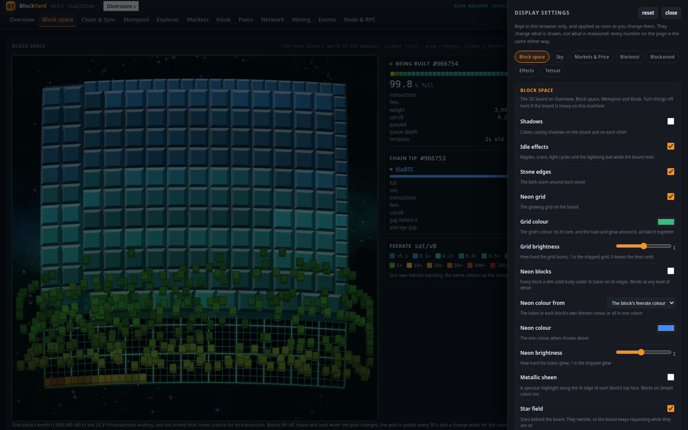

The panel is **tabbed**, in three labelled rows: **Boards** (Appearance, Block space, Sky,
Markets & Price), **Effects** (Space effects, Market effects) and **Diversions** (Tetrust,
Blockout, Blockanoid). The two **effects** tabs are lists of switches, so they also get **all
on** and **all off**; twenty-nine of them is a lot of clicking otherwise.

### Appearance

The colours of the layout: the page, its cards, text, lines, the accent, and the axis text, grid
lines and tooltips of every chart. The 3D boards are space whatever you choose, and the
Explorer's block and transaction pages keep their own dark cards.

- **Theme mode** — Light, Dark or System. Every theme has a light face and a dark face; the mode
  picks which. System follows the operating system's setting and changes with it.
- **Theme** — a card per theme, each with a strip of its swatches in the face the mode picks:
  - **BlockYard** — the shipped look, charcoal and bitcoin orange. The default; its dark face is
    exactly what the monitor drew before this tab existed.
  - **Mono** — clean grayscale, minimal and focused. The good, warning and bad colours stay, muted.
  - **Nous** — GitHub's chrome with a Nous blue accent.
  - **GitHub** — GitHub Light Default and Dark Default.
  - **Catppuccin** — the soothing pastels, Latte (light) and Mocha (dark).
  - **Custom** — your own nine colours, from the pickers below the cards.
- **customise …** — the button beside the cards copies the theme on screen into the nine pickers
  and selects Custom, so you start from a look rather than from scratch.
- **The nine pickers** — Page, Panels, Text, Muted text, Accent, Lines, Good, Warning and Bad.
  Everything else (a raised panel, the softer rules, the fainter text, the darker accent of a
  pressed button) is derived from them, so a custom theme hangs together whatever you pick.
  Whether Custom counts as light or dark follows from the Page colour, so a pale page gets dark
  derived shades and vice versa. The pickers are dimmed until Custom is the theme.

Like every other setting these are saved on the server, so the theme is the same on every screen
of this monitor; the sign-in page draws in the theme this browser last saw.

### Block space

The 3D board on Overview, Block space, Mempool and Kiosk. If the board is heavy on your machine,
these are the settings that buy it back, roughly most expensive first:

| setting | what it does |
|---|---|
| **Shadows** | Cubes casting shadows on the board and on each other. **Off by default**: it is the costliest single effect on a full board — one shadow per resting stone, more in flight — and the board is the first thing most people open. |
| **Level of detail** | **Simple cubes by default.** *Full* draws every facet and crown. *Simple cubes* drops the crown at every size and draws far fewer facets. *Flat tiles* drops both entirely. The seam around each stone stays under **Stone edges**, in every mode. |
| **Refresh animation** | *Full flight* is the 20-second choreography of blocks lifting, travelling and landing. *Quick* is about six seconds. *None* lands the new layout at once. |
| **Idle effects** | The master switch for the effects that play while the board rests. Which of them may play is the **Space effects** tab. |
| **Stone edges** | The dark seam drawn around each stone. |
| **Neon grid** | The glowing grid on the board. |
| **Grid colour** | The grid's colour. One choice drives the whole grid: its lit core, the halo and glow around it, and the brighter line along the board's edge, so they stay a family rather than drifting apart. |
| **Grid brightness** | How hard the grid burns, from 0 to 2. 1 is the shipped grid; 0 leaves the lines drawn but unlit. |
| **Neon blocks** | Each block becomes a dim solid body in its own fee-rate colour under lit neon tubes along every edge it shows. Works at every level of detail, Simple cubes included. |
| **Neon colour from** | *The block's fee-rate colour* keeps the palette, so the tubes still tell you what the block costs. *One colour* lights every block the same. |
| **Neon colour** / **Neon brightness** | The one colour, when you have chosen it, and how hard the tubes glow (0.2x to 2x). |
| **Metallic sheen** | A specular highlight along the lit edge of each block's top face and a dark roll-off on the far one. Works on Simple cubes too. |
| **Metallic finish** | *Chrome* mirrors a horizon in every face, and the reflection slides as the blocks move; *satin* is the softer highlight along the lit edge. Needs Metallic sheen on. |
| **Departures and arrivals** | How blocks leave and rejoin the board on a refresh. |
| **Depth** | How much height foreshortens, 0 to 0.001. 0 is the flat parallel camera the board shipped with: a cube is the same size however high it flies. Raise it and a cube's top grows a little wider than its base and a flying block swells slightly as it rises. |
| **Star field** | On by default. The stars twinkle, so the board keeps repainting while they are on; switch it off to save that. What the stars *look* like is the **Sky** tab. |
| **Board curve** | How far the board bows toward you. 0 is flat. |
| **Light** | Where the lamp hangs: *straight above* (the default) lights the whole board evenly, which keeps the front rows as bright as the middle; a corner shades the far slope of the curve and the sides turned away from it. |

### Sky

One sky, shared by every board that shows stars — so the density you choose applies to Block
space, Markets and Tetrust alike. Whether a given board shows it stays that board's own switch.

| setting | what it does |
|---|---|
| **Star density** / **Star brightness** | How many stars (up to 8x the shipped number) and how strongly they burn. |
| **Spiral galaxy** | Lays the same stars on slowly turning spiral arms instead of scattering them evenly. One turn takes about a quarter of an hour. |
| **Galaxy centre** | Behind the board, or any of the four corners. A corner crowds the bright nucleus there and sweeps the arms across the panel. |
| **Nebulae**, **Dust lanes**, **Star clusters**, **Distant galaxies** | The layers of the sky, each its own switch: gas clouds along the arms, dark ribbons on their inner edges, tight knots out in the halo, and small faint galaxies in the deep field behind everything. |
| **Star colours** | Warm old stars in the nucleus, blue-white young ones in the arms. Off is one colour of starlight. |
| **Star glints** | The halo and cross glint on the brightest stars. |

### Space effects and Market effects

One tab per board. **Space effects** is a switch for each of the **29** idle effects the Block
space board can play, listed under [Idle effects](#idle-effects) above; **Market effects** is a
switch for each of the **16** the Markets board can play (named under Idle effects). Each tab has **all on** and **all off**, and its own
**No repeats within**: how many other effects must play before one can play again (12 by
default; 0 allows a repeat straight away).

Each tab also sets **its board's cadence**: **Between effects, at least** and **Between
effects, at most** (seconds; the board rests a random span between the two after each effect
— 5 to 9 by default, up to ten minutes each on Space effects and five on Market effects; set the floor above the ceiling and they swap).
The Space effects tab has one more, **First effect after landing** (seconds, give or take a
third, before the first effect once the blocks land — 1.2 by default, up to two minutes; the
board re-lays on every refresh, so this is also how soon one follows each refresh). The candle
board has no landing, so the Markets tab has no such slider: its first effect after a refresh
keeps the cadence. Push both "between" sliders up for an effect only now and then; the switches
and **all off** are still the way to a board that never plays one. Turning a tab's switches all off leaves that board
still; so does the single **Idle effects** switch on the Block space tab, or **Board effects** on
Markets & Price.

### Markets & Price

First the feed itself: **Enable market polling**, off out of the box, is the one switch that
lets this monitor talk to anyone but your node (see [Markets](#markets)). Then the candle board
on Markets and Kiosk: the **star field** on or off, and **board effects** — one switch for
everything that moves on this board, both the idle effects and the flight when the candles
refresh. Which idle effects may play is the **Market effects** tab.

Your toolbar choices are remembered too: the **exchange** whose candles are drawn and the
**range** (24 hours, 48 hours or 7 days). Click them on the Markets page or set them here; either
way the page opens where you left it.

| setting | what it does |
|---|---|
| **Enable market polling** | **Off by default.** Lets the server ask five exchanges for prices, candles and order books — the only thing the monitor ever says to anyone but your node. Until it is on, Markets and Kiosk say so and the explorer shows no dollar figures. Shared by every screen; takes effect at once, and unticking parks the feed at once. (`BLOCKYARD_MARKETS=0` on the server removes the feed so that this box cannot turn it on.) |
| **Price line on Overview** | The USD median, spread, 24 h volume and how many books reported, at the top of Overview. It needs market polling (above); with that on, this monitor then contacts five exchanges whenever Overview is open, not only on Markets and Kiosk. Switch it off and the landing page talks to nothing but your node. |
| **Price view** | Which price panel Markets draws: the *flat chart* (default) or the *3D candle board*. One at a time; the 2D / 3D buttons on the page set the same thing. |

### Blockout

The Breakout court. Four of these — **star field**, **spiral galaxy**, **neon bricks** and **sound
effects** — are the same switches that sit on the game's own panel, so a change in either place
shows in both. The rest are here only:

| setting | what it does |
|---|---|
| **Galaxy centre** | Where the spiral's nucleus sits on the panel: behind the court, or any corner. |
| **Neon colour from** / **Neon colour** / **Neon brightness** | The tubes in each brick row's own colour, or all in one colour of your choosing, at the brightness you set. |
| **Grid** / **Grid colour** / **Grid intensity** | The grid under the court: whether it is drawn at all, what colour it is, and how strongly it shows. Turn the intensity down for a quieter court, or the switch off for none. |

What the sky is *made of* — density, brightness, nebulae, dust and the rest — comes from the
**Sky** tab, which every board shares.

### Blockanoid

The Arkanoid court. **Star field**, **spiral galaxy**, **neon bricks** and **sound effects** are the
same switches that sit on the game's own panel. Two more are here only, and they change the *rules*:

| setting | what it does |
|---|---|
| **Capsules** | Whether broken bricks drop the falling letters at all. Off makes it a pure Breakout. |
| **Minions** | Whether the drifting shapes turn up. Off clears the ones already on the court. |
| **Galaxy centre** | Where the spiral's nucleus sits on the panel. |
| **Neon colour from** / **Neon colour** / **Neon brightness** | The tubes in each brick's own colour, or all in one colour of your choosing, at the brightness you set. |
| **Grid** / **Grid colour** / **Grid intensity** | The grid under the court: whether it is drawn at all, what colour it is, and how strongly it shows. |

### Tetrust

The game's own settings. Four of them — **star field**, **spiral galaxy**, **music** and **sound
effects** — are the same switches that appear on the game's own panel, so a change in either place
shows in both. The rest are here only:

| setting | what it does |
|---|---|
| **Galaxy centre** | Where the spiral's nucleus sits on the panel: behind the title, or any corner. |
| **Landing marker** | The colour of the wireframe showing where the falling piece will land. It has its own colour because the marker is drawn *instead of* a block rather than over one, so the neon finish below never touches it. |
| **Landing marker thickness** | How heavy that outline is, from 0.3 to 2.5 times the shipped weight. Thinner keeps it out of the way of the stack showing through it. |
| **Neon pieces** | The pieces and the stack as dim solid bodies under lit tubes, the same finish as the Block space board. |
| **Neon colour from** / **Neon colour** / **Neon brightness** | The tubes in each piece's own colour, or all in one colour of your choosing, at the brightness you set. |
| **Grid** / **Grid colour** / **Grid intensity** | The grid under the well: whether it is drawn at all, what colour it is, and how strongly it shows. The well draws its grid fainter than the brick courts do, because the stack sits on top of it. |

What the sky is *made of* — density, brightness, nebulae, dust and the rest — comes from the
**Sky** tab, which every board shares.
